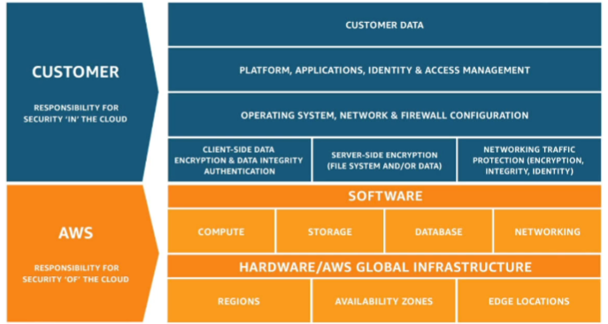

# Cloud Computing

> CLF-C02 focus: core cloud concepts and basic AWS global infrastructure.

## What is cloud computing?

Cloud computing is the on-demand delivery of IT resources over the internet with pay-as-you-go pricing. Instead of buying and maintaining physical servers and data centers, you provision resources such as compute, storage, and databases when needed.

## Deployment models

| Model | Where workloads run |
| --- | --- |
| Cloud | On cloud-provider infrastructure, such as an AWS Region |
| On premises | In a customer's own data center or facility |
| Hybrid | Across cloud and on-premises environments, with connectivity or integration between them |

The AWS Management Console is useful for interactive operations; APIs, the AWS CLI, SDKs, and infrastructure as code support programmatic or repeatable work. [IAM Identity and Access](02-iam-identity-and-access.md) covers CLI and SDK access, while [Other Services, Backup, and Migration](18-other-services-backup-and-migration.md) introduces CloudFormation templates.

## Six advantages of cloud computing

- **Trade fixed expense for variable expense:** Pay for resources as you use them.
- **Benefit from economies of scale:** AWS can offer lower variable costs by aggregating demand.
- **Stop guessing capacity:** Scale resources to match demand.
- **Increase speed and agility:** Provision resources in minutes instead of weeks.
- **Stop maintaining data centers:** Focus on applications instead of physical infrastructure.
- **Go global quickly:** Deploy workloads closer to users around the world.

## AWS global infrastructure basics

### Regions

An **AWS Region** is an isolated geographic area containing multiple Availability Zones.

- Workloads and data are not automatically copied to another Region.
- Choose a Region based on compliance and legal requirements, proximity to users, service availability, and pricing.
- Most resources are Region-specific. Changing the selected Region in the AWS Management Console changes which resources are displayed; it does not move or delete them.

### Availability Zones

An **Availability Zone (AZ)** is one or more discrete data centers with independent power, networking, and connectivity inside a Region.

- AWS Regions contain multiple AZs and are generally designed with at least three.
- AZs in a Region are connected through high-bandwidth, low-latency networking.
- Using multiple AZs improves availability if one AZ fails.

### Edge locations and regional edge caches

AWS uses Points of Presence, including edge locations and regional edge caches, to deliver content closer to users and reduce latency.

> [!NOTE]
> AWS infrastructure counts change over time. Understand the purpose of Regions, AZs, and edge locations rather than memorizing exact numbers.

## Shared responsibility model

- **AWS is responsible for security of the cloud:** the physical facilities, hardware, networking, and foundational infrastructure.
- **The customer is responsible for security in the cloud:** customer data, identities, access, applications, and resource configuration.

The exact division depends on the AWS service. Service-specific examples are covered in the later Security and Compliance chapter.

## Exam memory checks

1. **Which factors influence Region selection?** Compliance, proximity and latency, service availability, and price.
2. **What improves availability during an AZ failure?** Deploying across multiple Availability Zones.
3. **Who secures AWS physical infrastructure?** AWS - security of the cloud.
4. **Does changing the console Region move resources?** No. It only changes which regional resources are displayed.
5. **What is a hybrid deployment?** A workload or environment spanning cloud and on-premises resources.

## References

- [AWS Certified Cloud Practitioner CLF-C02 exam guide](https://docs.aws.amazon.com/aws-certification/latest/cloud-practitioner-02/cloud-practitioner-02.html)
- [What is cloud computing?](https://docs.aws.amazon.com/whitepapers/latest/aws-overview/what-is-cloud-computing.html)
- [Six advantages of cloud computing](https://docs.aws.amazon.com/whitepapers/latest/aws-overview/six-advantages-of-cloud-computing.html)
- [AWS Global Infrastructure](https://aws.amazon.com/about-aws/global-infrastructure/)
- [AWS Shared Responsibility Model](https://docs.aws.amazon.com/whitepapers/latest/introduction-devops-aws/shared-responsibility.html)
