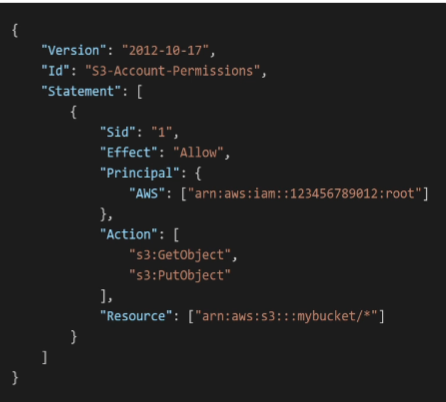

# IAM Identity and Access

> CLF-C02 focus: authentication, authorization, IAM identities, permissions, credentials, and security best practices.

## What is IAM?

AWS Identity and Access Management (IAM) controls **who is authenticated** and **what they are authorized to do** in an AWS account. IAM is a global service, so IAM users, groups, roles, and policies are not created separately in each Region.

| Concept | Question it answers |
| --- | --- |
| Authentication | Who are you? |
| Authorization | What are you allowed to do? |

## AWS account root user

The root user is created with the AWS account and has unrestricted access to the account.

- Do not use the root user for everyday work.
- Protect it with multi-factor authentication (MFA).
- Do not create root access keys unless they are required for a specific exceptional task.
- Create administrative access for normal administration instead of sharing root credentials.

> [!NOTE]
> Tasks that specifically require the root user are covered in the later Security and Compliance chapter.

## IAM identities

### IAM users

An **IAM user** represents one person or application that needs an identity in a single AWS account.

- A user can have a console password, access keys, or both.
- A user can belong to no groups or to multiple groups.
- Permissions can be attached directly to a user, but groups and roles are usually easier to manage at scale.
- Current AWS guidance favors temporary credentials and federation for human users instead of creating long-term IAM users for everyone.

### IAM user groups

An **IAM user group** is a collection of IAM users, such as `Developers` or `Operations`.

- Policies attached to a group are inherited by every user in that group.
- Groups contain users only; they cannot contain roles or other groups.
- Groups do not have credentials and cannot sign in or make requests themselves.

### IAM roles

An **IAM role** is an identity with permissions that a trusted principal can assume.

- Roles provide temporary security credentials rather than standard long-term credentials.
- AWS services can assume roles to perform actions on your behalf.
- Roles also support cross-account access and federated access.
- A role has a **trust policy** that defines who can assume it and permissions policies that define what the role can do.

> [!TIP]
> Prefer roles for workloads and temporary access. AWS IAM Identity Center, federation, and AWS Security Token Service (STS) are covered in the Advanced Identity chapter.

### Tags

Tags are key-value labels that help organize IAM resources. They can also support attribute-based access control when policies use tag-based conditions.

## IAM policies

IAM policies are JSON documents that define permissions. A policy can allow or deny actions on specified resources, optionally only under certain conditions.

### Identity-based and resource-based policies

| Policy type | Attached to | Purpose |
| --- | --- | --- |
| Identity-based policy | User, group, or role | Defines what that identity can do |
| Resource-based policy | AWS resource, such as an S3 bucket | Defines who can access that resource and what they can do |

Resource-based policies are covered again only where a service uses them, such as S3 bucket policies. The core policy concepts remain in this chapter.

### Managed and inline policies

- **AWS managed policy:** Created and maintained by AWS and reusable across identities.
- **Customer managed policy:** Created and maintained in your account and reusable across identities.
- **Inline policy:** Embedded directly in one user, group, or role. It has a one-to-one relationship with that identity.


### Policy structure



| Element | Meaning |
| --- | --- |
| `Version` | Version of the policy language, commonly `2012-10-17` |
| `Id` | Optional identifier for the policy |
| `Statement` | One or more permission statements |
| `Sid` | Optional identifier for an individual statement |
| `Effect` | `Allow` or `Deny` |
| `Principal` | Account, user, role, federated identity, or service to which a resource-based policy applies |
| `Action` | API actions that are allowed or denied |
| `Resource` | Resources to which the actions apply, usually identified by ARN |
| `Condition` | Optional restrictions that determine when the statement applies |

`Principal` normally appears in resource-based policies and role trust policies. Identity-based policies are already attached to an identity, so they usually do not contain a `Principal` element.

### Policy evaluation

Use this simplified order for the exam:

1. Requests are implicitly denied by default.
2. An applicable explicit `Allow` can grant access.
3. An applicable explicit `Deny` overrides every `Allow`.

Permissions from applicable policies are evaluated together. A user can receive permissions from directly attached policies and from every group to which the user belongs.

### Least privilege

Grant only the actions and resources required to perform a task. Add permissions when a valid need appears instead of starting with broad access.

This statement grants full administrative access and should be used carefully:

```json
{
  "Effect": "Allow",
  "Action": "*",
  "Resource": "*"
}
```

## Credentials and access methods

| Access method | Credentials or authorization |
| --- | --- |
| AWS Management Console | Password and, when enabled, MFA |
| AWS CLI | Access keys or temporary credentials |
| AWS SDK | Access keys or temporary credentials used by application code |
| AWS CloudShell | Console identity and permissions are forwarded to the shell |

### Access keys

An access key consists of:

- **Access key ID:** Identifies the access key.
- **Secret access key:** A secret used to sign programmatic requests.

Access keys are for programmatic access, not console sign-in. Do not embed them in source code. Prefer temporary credentials from roles whenever possible.

Temporary credentials also include a session token and expire after a limited period.

### AWS CLI and SDKs

- The **AWS Command Line Interface (CLI)** lets you manage AWS services with shell commands.
- An **AWS Software Development Kit (SDK)** provides language-specific libraries for calling AWS services from application code.

Both are governed by the permissions of the identity or role whose credentials they use.

## Password policy and MFA

An account-level IAM password policy can set requirements for IAM user passwords, such as minimum length, character requirements, expiration, and password reuse prevention. It does not control the root user password.

MFA requires an additional authentication factor beyond a password. Supported options include authenticator applications, passkeys or security keys, and hardware devices.

- Enable MFA for the root user.
- Require MFA for privileged access.
- Prefer phishing-resistant MFA, such as passkeys and security keys, where possible.

## IAM roles for AWS services

Assign a role to an AWS service when it must call another AWS service on your behalf.

For example, an EC2 instance can use an IAM role to access S3. Applications on the instance obtain temporary credentials automatically, so long-term access keys do not need to be stored on the server.

## AWS CloudShell

AWS CloudShell is a browser-based shell available from the AWS Management Console.

The official CLF-C02 guide explicitly lists CloudShell as out of scope. Keep this section as background; prioritize the CLI and SDK distinctions above.

- It is pre-authenticated with the permissions of the console identity.
- It includes the AWS CLI and common command-line tools.
- Its home directory provides persistent storage per AWS Region; files outside the home directory are temporary.

## IAM credential report

The IAM credential report is a downloadable account-level report containing IAM users and the status of their credentials, including passwords, access keys, and MFA devices.

Use it to audit credential age, unused credentials, and whether MFA is enabled.

## Best-practice summary

- Protect the root user and avoid using it for daily work.
- Require MFA, especially for privileged identities.
- Apply least privilege.
- Prefer federation and temporary credentials for people.
- Use IAM roles and temporary credentials for workloads.
- Remove unused users, roles, permissions, and credentials.
- Never share credentials or commit access keys to source control.

## Avoiding duplication in later chapters

- **S3:** Applies identity-based and bucket policies without redefining the IAM policy model.
- **Security and Compliance:** Covers IAM Access Analyzer, root-only tasks, and broader security auditing.
- **Account Management and Billing:** Covers AWS Organizations and service control policies (SCPs), which limit permissions but do not grant them.
- **Advanced Identity:** Covers STS, IAM Identity Center, Cognito, and Directory Services.

## Exam memory checks

1. **Which IAM identity should an EC2 workload use?** An IAM role.
2. **Do IAM groups have credentials?** No. They are collections of IAM users.
3. **Which policy decision wins?** An explicit `Deny` overrides an `Allow`.
4. **What happens when no policy allows an action?** The request is implicitly denied.
5. **What is the preferred permission model?** Least privilege.
6. **Are access keys used for console sign-in?** No. They are used for programmatic access.
7. **What does the credential report help audit?** Password, access-key, and MFA status for IAM users.
8. **Should applications on EC2 store IAM user access keys?** No. Attach an IAM role and use temporary credentials.

## References

- [What is IAM?](https://docs.aws.amazon.com/IAM/latest/UserGuide/)
- [Security best practices in IAM](https://docs.aws.amazon.com/IAM/latest/UserGuide/best-practices.html)
- [Policies and permissions in IAM](https://docs.aws.amazon.com/IAM/latest/UserGuide/access_policies.html)
- [IAM JSON policy grammar](https://docs.aws.amazon.com/IAM/latest/UserGuide/reference_policies_grammar.html)
- [Policy evaluation logic](https://docs.aws.amazon.com/IAM/latest/UserGuide/reference_policies_evaluation-logic_policy-eval-denyallow.html)
- [Temporary credentials for AWS resources](https://docs.aws.amazon.com/IAM/latest/UserGuide/id_credentials_temp_use-resources.html)
- [IAM credential reports](https://docs.aws.amazon.com/IAM/latest/UserGuide/id_credentials_getting-report.html)
- [AWS CloudShell concepts](https://docs.aws.amazon.com/cloudshell/latest/userguide/working-with-aws-cloudshell.html)
