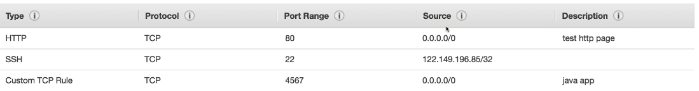

# Amazon EC2

> CLF-C02 focus: virtual servers, instance families, instance lifecycle, security groups, access methods, and the shared responsibility model.

## What is Amazon EC2?

Amazon Elastic Compute Cloud (Amazon EC2) provides resizable virtual servers, called **instances**, in the AWS Cloud. You choose the operating system, compute capacity, storage, networking, and security settings needed by a workload.

EC2 is an Infrastructure as a Service (IaaS) offering. AWS operates the physical facilities, servers, and virtualization layer; you configure and maintain the guest operating system and applications.

## Building blocks of an EC2 instance

| Building block | Purpose |
| --- | --- |
| Amazon Machine Image (AMI) | Template containing the operating system and optional software |
| Instance type | Combination of CPU, memory, networking, and storage capabilities |
| Storage | EBS volumes, instance store, or network file storage used by the instance |
| Security group | Stateful virtual firewall controlling allowed inbound and outbound traffic |
| Key pair | Public/private key credentials commonly used for SSH access |
| IAM role | Temporary AWS permissions for applications running on the instance |

AMIs and storage are covered in their own chapters. IAM roles are covered in [IAM Identity and Access](02-iam-identity-and-access.md).

## EC2 instance type names

An instance type name describes a family, generation, optional capabilities, and size. For example, in `m7i.large`:

- `m` is the instance family.
- `7` is the generation.
- `i` identifies an additional capability or processor choice.
- `large` is the size within the family.

Do not interpret every family letter literally. For the exam, recognize the workload categories and a few common family examples.

| Category | Common families | Best suited for |
| --- | --- | --- |
| General purpose | M, T | Balanced compute, memory, and networking; web servers and small databases |
| Compute optimized | C | CPU-intensive work such as batch processing and high-performance web servers |
| Memory optimized | R, X | In-memory databases, real-time analytics, and large caches |
| Storage optimized | I, D, H | Workloads requiring high local IOPS, dense storage, or high disk throughput |
| Accelerated computing | G, P, Inf, Trn | Graphics, machine learning, and hardware acceleration |
| High performance computing | Hpc | Large-scale scientific and engineering workloads |

The T family is **burstable general purpose**: it earns CPU credits when usage is low and can spend them to burst above a baseline. It is useful for workloads whose CPU demand is not continuously high.

> [!TIP]
> Choose an instance type for the workload. A larger instance is not automatically the best or most cost-effective choice.

## Instance lifecycle

| Action/state | What happens |
| --- | --- |
| Launch | AWS creates an instance from an AMI using the selected type and configuration |
| Running | The instance is operating and can serve a workload |
| Reboot | The operating system restarts; the instance remains on the same host when possible |
| Stop | An EBS-backed instance shuts down; its EBS volumes remain, but instance-store data is lost |
| Start | A stopped instance starts again, potentially on different physical hardware |
| Terminate | The instance is permanently removed; attached volumes follow their delete-on-termination settings |

Stopping and terminating are different. An EBS-backed stopped instance can be started again, while a terminated instance cannot.

EC2 pricing models, billing behavior, and cost tools belong in the later Billing and Pricing chapter.

## Security groups

A security group acts as a virtual firewall for resources such as EC2 instances.

- **Inbound rules** define traffic allowed to reach the instance.
- **Outbound rules** define traffic allowed to leave the instance.
- Security groups contain **allow rules only**; they do not have explicit deny rules.
- Security groups are **stateful**. Return traffic for an allowed connection is automatically permitted.
- One instance can use multiple security groups, and one security group can protect multiple instances.
- Rules can refer to IP ranges, ports, protocols, or another security group.

Common rules include:

| Purpose | Protocol/port | Safer source |
| --- | --- | --- |
| SSH to Linux | TCP 22 | Administrator's trusted IP range |
| RDP to Windows | TCP 3389 | Administrator's trusted IP range |
| HTTP website | TCP 80 | Internet or a load balancer security group |
| HTTPS website | TCP 443 | Internet or a load balancer security group |

Avoid allowing administrative ports such as SSH or RDP from `0.0.0.0/0`, which means every IPv4 address. A separate security group for administration can make access easier to review.

Network ACLs, subnets, route tables, and deeper network filtering belong in the later VPC chapter.

## Connecting to and managing an instance

| Method | Typical use |
| --- | --- |
| SSH | Command-line login to a Linux instance |
| RDP | Graphical login to a Windows instance |
| EC2 Instance Connect | Browser or command-line SSH connection using a short-lived public key |
| AWS Systems Manager Session Manager | Shell access without opening inbound SSH or RDP ports when the instance is configured for Systems Manager |
| AWS Management Console, CLI, or SDK | Manage EC2 resources through AWS APIs; these are not operating-system login protocols |

Applications running on EC2 should use an attached IAM role for AWS access instead of storing long-term access keys on the instance.

## Shared responsibility for EC2

| AWS is responsible for | You are responsible for |
| --- | --- |
| Facilities, physical servers, networking, and the virtualization layer | Guest operating system updates and security patches |
| Replacing failed underlying hardware | Applications, data, IAM permissions, and network rules |
| Security **of** the cloud | Security **in** the cloud |

Managed services shift more operational work to AWS. Because EC2 gives you control of the operating system, it also gives you more responsibility than a fully managed service.

## Exam memory checks

1. **What does EC2 provide?** Resizable virtual servers called instances.
2. **What is the difference between an AMI and an instance type?** The AMI is the software launch template; the instance type defines compute, memory, networking, and storage capabilities.
3. **Are security groups stateful?** Yes. Response traffic for an allowed connection is automatically permitted.
4. **Can a security group explicitly deny traffic?** No. Security groups contain allow rules only.
5. **Which login methods commonly match Linux and Windows?** SSH for Linux and RDP for Windows.
6. **How can an administrator connect without opening inbound SSH or RDP ports?** Systems Manager Session Manager, when the instance and permissions are configured for it.
7. **Can a terminated EC2 instance be started again?** No. A stopped EBS-backed instance can be restarted, but a terminated instance cannot.
8. **Who patches the guest operating system on EC2?** The customer.

## Avoiding duplication in later chapters

- EC2 purchasing options, the Free Tier, budgets, and billing alerts: Billing and Pricing
- VPCs, subnets, public IP addresses, routing, and network ACLs: Networking
- CloudWatch metrics, alarms, and detailed monitoring: Monitoring
- AMIs and EC2 storage: the next two chapters

## References

- [Amazon EC2 instance types](https://docs.aws.amazon.com/ec2/latest/instancetypes/instance-types.html)
- [Amazon EC2 security groups](https://docs.aws.amazon.com/AWSEC2/latest/UserGuide/ec2-security-groups.html)
- [Connect to your Linux instance using EC2 Instance Connect](https://docs.aws.amazon.com/AWSEC2/latest/UserGuide/connect-linux-inst-eic.html)
- [Connect to your instance using Session Manager](https://docs.aws.amazon.com/systems-manager/latest/userguide/session-manager-working-with-sessions-start.html)
