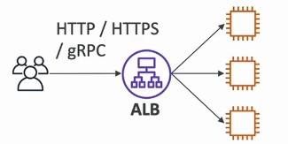
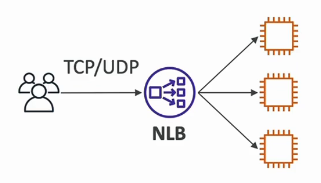
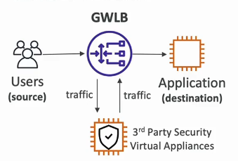
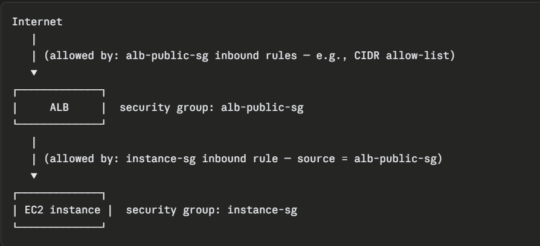
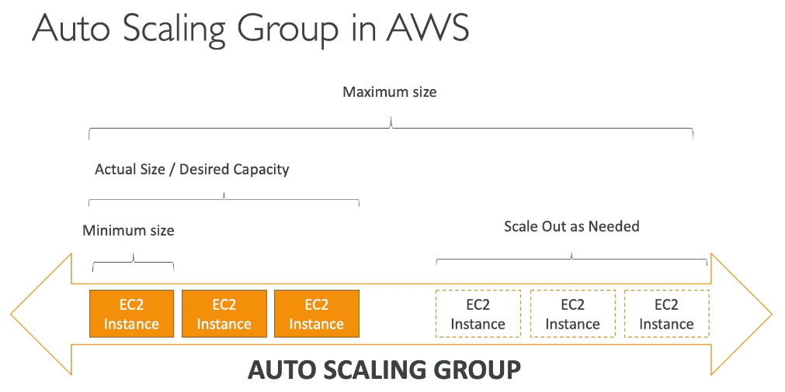
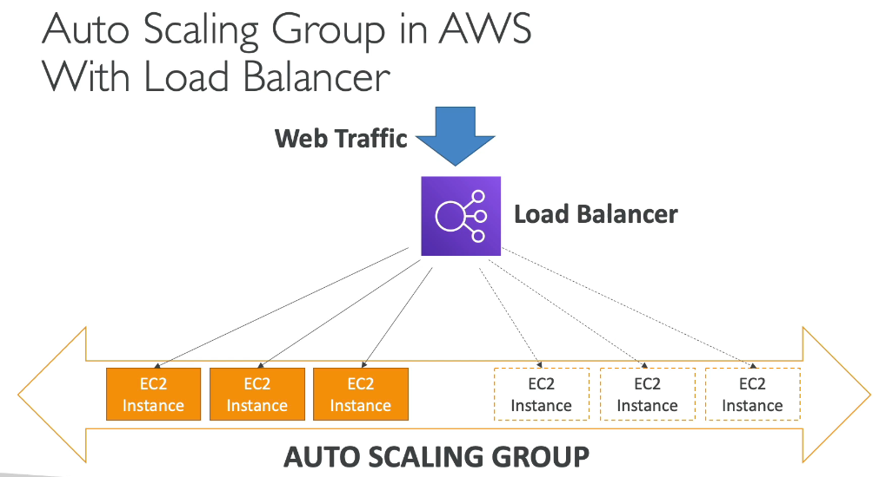

# Elastic Load Balancing and EC2 Auto Scaling

> CLF-C02 focus: distributing traffic, checking target health, maintaining capacity, and scaling EC2 instances as demand changes.

## Why use load balancing and Auto Scaling together?

Elastic Load Balancing (ELB) distributes incoming traffic across healthy targets. EC2 Auto Scaling adjusts the number of EC2 instances and replaces unhealthy ones.

Together they support:

- **High availability:** traffic can use healthy targets across multiple Availability Zones.
- **Elasticity:** capacity can grow and shrink with demand.
- **Fault tolerance:** failed instances can be removed from service and replaced.

## Elastic Load Balancing

A load balancer gives clients a single DNS name and routes requests to registered targets such as EC2 instances, IP addresses, or containers, depending on the load balancer type.

AWS manages the load balancer infrastructure. The service can scale its own capacity and route traffic only to targets that pass configured health checks.

### Core components

| Component | Purpose |
| --- | --- |
| Listener | Checks for client connections using a configured protocol and port |
| Listener rule | Decides how matching requests should be routed |
| Target group | Logical group of destinations that receive traffic |
| Target | Resource receiving traffic, such as an EC2 instance or IP address |
| Health check | Repeated test used to decide whether a target should receive traffic |

When a target fails its health checks, the load balancer stops sending new requests to it. The load balancer does not repair the target; an Auto Scaling group can replace an unhealthy EC2 instance.

## Types of load balancer

| Type | Layer and protocols | Best fit |
| --- | --- | --- |
| Application Load Balancer (ALB) | Layer 7; HTTP, HTTPS, and gRPC | Web applications, path/host routing, microservices, and containers |
| Network Load Balancer (NLB) | Layer 4; TCP, UDP, and TLS | Very high performance, low latency, static IP needs, and non-HTTP traffic |
| Gateway Load Balancer (GWLB) | Layer 3 gateway using GENEVE | Deploying and scaling third-party virtual network appliances |
| Classic Load Balancer (CLB) | Previous generation; Layer 4 and basic Layer 7 | Legacy applications; use a current-generation load balancer for new designs |

### Application Load Balancer

An ALB understands application-level requests and can route using content such as host names and URL paths. For example, `/orders` and `/images` can be sent to different target groups.

### Network Load Balancer

An NLB handles transport-level connections. It is designed for very high throughput and low latency and can provide static IP addresses for its Availability Zones.

### Gateway Load Balancer

A GWLB sends network traffic through a fleet of virtual appliances, such as firewalls, intrusion detection systems, and deep packet inspection systems. It uses the GENEVE protocol between the gateway load balancer and its appliances.

### Classic Load Balancer

CLB is the previous-generation offering. Existing workloads may still use it, but ALB, NLB, or GWLB provide the more specialized current designs.

## Load balancer security groups

ALBs use security groups. A common web architecture is:

1. The load balancer security group allows HTTP or HTTPS from clients.
2. The EC2 instance security group allows application traffic only from the load balancer security group.
3. The instances do not need to accept application traffic directly from the internet.

NLB security behavior and detailed VPC architecture are covered later in the Networking chapter.

## EC2 Auto Scaling

An Auto Scaling group (ASG) is a logical group of EC2 instances managed as one unit. It attempts to keep the requested number of healthy instances running.

### Capacity settings

| Setting | Meaning |
| --- | --- |
| Minimum capacity | Lowest capacity the group should maintain |
| Desired capacity | Capacity the group currently attempts to run |
| Maximum capacity | Highest capacity the group can reach through normal scaling |

For example, with a minimum of 2, desired capacity of 4, and maximum of 8, the group tries to run 4 instances, never scales below 2, and normally does not scale above 8.

### Launch templates

An Auto Scaling group needs a definition for new instances. A launch template can specify:

- AMI
- Instance type
- Security groups
- Storage configuration
- IAM instance profile
- User data startup script

The launch template supplies the recipe; the Auto Scaling group manages the number and health of instances created from it.

### Health and replacement

An ASG can use EC2 status checks and, when integrated, load balancer health checks. If an instance is considered unhealthy, the group terminates it and launches a replacement to restore desired capacity.

Place an ASG across multiple Availability Zones so capacity is not dependent on a single AZ.

## Integrating ELB and Auto Scaling

When a target group is attached to an Auto Scaling group:

- New instances are registered with the load balancer.
- Instances removed by the group are deregistered.
- The load balancer sends traffic only to healthy registered targets.
- The ASG can use load balancer health checks to replace unhealthy instances.

The load balancer and Auto Scaling group solve different problems:

| Service | Main job |
| --- | --- |
| Elastic Load Balancing | Distribute traffic across healthy targets |
| EC2 Auto Scaling | Maintain and adjust EC2 capacity |

## Scaling methods

### Manual scaling

You directly change the minimum, desired, or maximum capacity. This is useful for one-off changes but does not automatically react to demand.

### Target tracking scaling

You choose a metric and target value, such as keeping average CPU utilization near 50 percent. EC2 Auto Scaling changes desired capacity to keep the metric near that target, similar to a thermostat.

### Step scaling

CloudWatch alarm thresholds trigger different scaling adjustments based on the size of the alarm breach. A modest breach might add one instance, while a large breach might add several.

### Simple scaling

One alarm triggers one scaling adjustment followed by a cooldown period. It is supported, but target tracking and step scaling are usually more responsive choices.

### Scheduled scaling

Capacity changes at known times. This is useful for predictable events, such as increasing capacity before business hours and reducing it overnight.

### Predictive scaling

AWS analyzes historical load patterns, forecasts future demand, and schedules capacity ahead of expected traffic. It fits workloads with recurring patterns.

Dynamic and predictive scaling can be combined: predictive scaling prepares for forecast demand, while dynamic scaling responds to current conditions.

## Scale out versus scale up

- **Scale out/in:** add or remove instances. EC2 Auto Scaling primarily performs horizontal scaling.
- **Scale up/down:** change to a larger or smaller instance. This is vertical scaling and usually requires replacement or a stop/start workflow.

For highly available applications, horizontal scaling across multiple instances and Availability Zones is generally more resilient than relying on one very large instance.

## Exam memory checks

1. **What is the difference between ELB and EC2 Auto Scaling?** ELB distributes traffic; EC2 Auto Scaling maintains and adjusts EC2 capacity.
2. **Which load balancer supports content-based HTTP routing?** Application Load Balancer.
3. **Which load balancer fits TCP/UDP traffic, very high performance, or static IP requirements?** Network Load Balancer.
4. **Which load balancer sends traffic through virtual network appliances?** Gateway Load Balancer.
5. **Which load balancer is the previous generation?** Classic Load Balancer.
6. **What happens when an ELB target fails its health check?** ELB stops sending new traffic to it.
7. **What are the three main ASG capacity settings?** Minimum, desired, and maximum capacity.
8. **What defines how an ASG launches a new instance?** A launch template.
9. **Which scaling method acts like a thermostat?** Target tracking scaling.
10. **Which methods prepare for known or recurring demand?** Scheduled scaling uses known times; predictive scaling forecasts demand from historical patterns.

## Avoiding duplication in later chapters

- CloudWatch metrics, alarms, dashboards, and log monitoring: Monitoring
- VPCs, subnets, routes, and network ACLs: Networking
- AWS WAF, Shield, and inspection architecture: Security
- Instance purchasing options and detailed cost optimization: Billing and Pricing

## References

- [How Elastic Load Balancing works](https://docs.aws.amazon.com/elasticloadbalancing/latest/userguide/how-elastic-load-balancing-works.html)
- [Choose a load balancer type](https://docs.aws.amazon.com/elasticloadbalancing/latest/userguide/what-is-load-balancing.html)
- [Gateway Load Balancer overview](https://docs.aws.amazon.com/elasticloadbalancing/latest/gateway/introduction.html)
- [Auto Scaling group capacity limits](https://docs.aws.amazon.com/autoscaling/ec2/userguide/asg-capacity-limits.html)
- [Dynamic scaling for Amazon EC2 Auto Scaling](https://docs.aws.amazon.com/autoscaling/ec2/userguide/as-scale-based-on-demand.html)
- [Scheduled scaling](https://docs.aws.amazon.com/autoscaling/ec2/userguide/ec2-auto-scaling-scheduled-scaling.html)
- [Predictive scaling](https://docs.aws.amazon.com/autoscaling/ec2/userguide/predictive-scaling-policy-overview.html)
