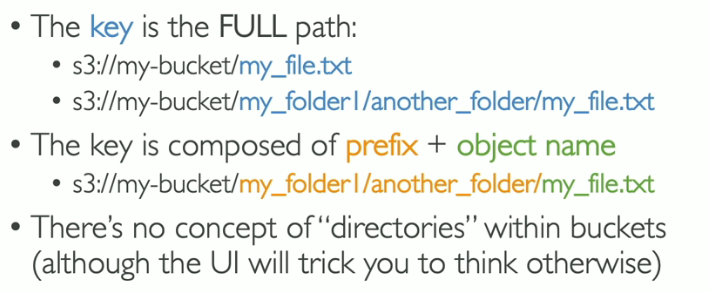
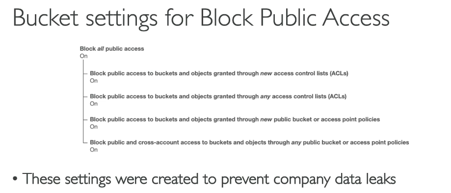
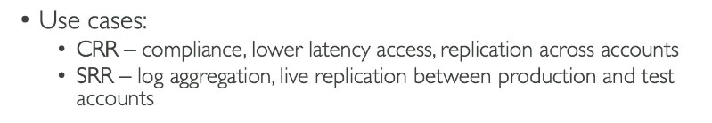
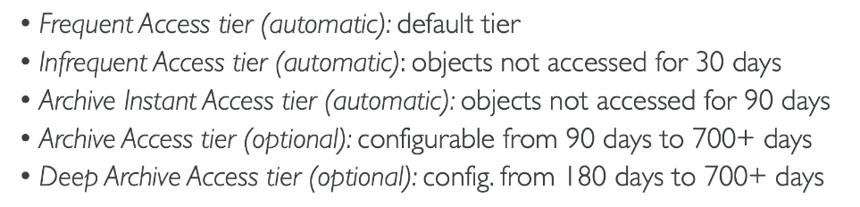
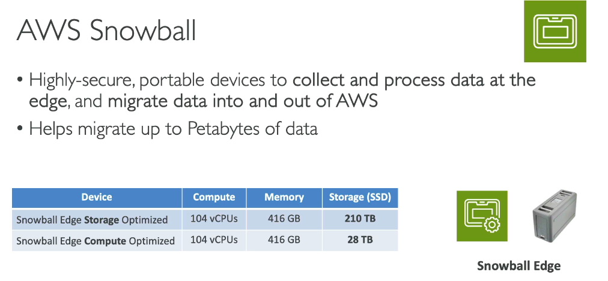

# Amazon S3 and Hybrid Storage

> CLF-C02 focus: object storage, access control, versioning, replication, storage classes, lifecycle management, encryption, and hybrid storage choices.

## What is Amazon S3?

Amazon Simple Storage Service (Amazon S3) is a managed **object storage** service. It stores data as objects inside buckets rather than as disks or a traditional file system.

Common uses include backups, archives, data lakes, application assets, log storage, static websites, and media distribution.

| Concept | Meaning |
| --- | --- |
| Bucket | Regional container for objects |
| Object | Data, metadata, and an object key |
| Key | Full name that uniquely identifies an object in a bucket |
| Prefix | Beginning of a key used to organize and filter objects |

Bucket names must be unique across the relevant AWS partition, not merely within one account. The bucket itself is created in an AWS Region.

The console displays prefixes like folders, but S3 is a flat object store. For example, `photos/2026/image.jpg` is one key; `photos/2026/` is a prefix rather than a real directory.

An object can be as large as 50 TB. Large objects use multipart upload; a single upload request cannot carry an object of that size. The 5 TB limit in older course material was increased in December 2025.

## Access control

New S3 buckets and objects are private by default.

### IAM and bucket policies

| Control | Attached to | Typical purpose |
| --- | --- | --- |
| IAM identity policy | User, group, or role | Defines which S3 actions an identity can perform |
| S3 bucket policy | Bucket | Resource-based policy defining who can access the bucket and its objects |
| Access control list (ACL) | Bucket or object | Legacy access mechanism; disabled by default for modern buckets using bucket-owner-enforced Object Ownership |

The normal policy evaluation rules from [IAM Identity and Access](02-iam-identity-and-access.md) still apply: an explicit `Deny` overrides an `Allow`.

### S3 Block Public Access

S3 Block Public Access prevents policies or ACLs from accidentally exposing buckets and objects publicly. New buckets have all four bucket-level Block Public Access settings enabled by default.

Keep Block Public Access enabled unless a specific design requires public access. CloudFront with Origin Access Control is usually a safer way to publish content from a private S3 bucket.

### Presigned URLs

A presigned URL grants time-limited access to one S3 object using the permissions of the identity that created the URL. It is useful for temporary downloads or uploads without making the bucket public.

## Versioning and deletion protection

S3 Versioning preserves multiple versions of an object in the same bucket.

- Updating an object creates a new version.
- A normal delete adds a delete marker instead of permanently removing older versions.
- A specific version can still be permanently deleted by an authorized principal.
- Versioning helps recover from accidental overwrite or deletion.
- After versioning is enabled, it can be suspended but not returned to the original never-enabled state.

Versioning is not a complete backup strategy by itself. Cross-account replication or AWS Backup can add separation from the source account; those broader backup strategies are covered later.

## S3 Replication

S3 Replication asynchronously copies eligible objects and their metadata to another bucket.

| Type | Destination | Typical use |
| --- | --- | --- |
| Same-Region Replication (SRR) | Bucket in the same Region | Log aggregation, separate test data, or replication between accounts |
| Cross-Region Replication (CRR) | Bucket in another Region | Compliance, regional proximity, or disaster recovery |

Both source and destination buckets must have versioning enabled, and S3 needs an IAM role with permission to replicate. Replication normally applies to new objects after the rule is configured; existing objects require S3 Batch Replication or another migration process.

## S3 storage classes

Choose a storage class based on access frequency, retrieval speed, resilience, and minimum storage duration. Avoid memorizing exact prices because they vary by Region and change over time.

| Storage class | Best for | Important distinction |
| --- | --- | --- |
| S3 Standard | Frequently accessed data | Millisecond access across at least three AZs; no minimum duration |
| S3 Intelligent-Tiering | Unknown or changing access patterns | Automatically moves objects between access tiers; monitoring fee and no retrieval fee |
| S3 Standard-IA | Long-lived, infrequently accessed data | Multi-AZ, millisecond access, retrieval charge, 30-day minimum |
| S3 One Zone-IA | Re-creatable infrequently accessed data | One AZ, lower cost, retrieval charge, 30-day minimum |
| S3 Glacier Instant Retrieval | Rarely accessed archive needing immediate access | Millisecond retrieval, 90-day minimum |
| S3 Glacier Flexible Retrieval | Archive that can wait minutes or hours | Expedited, standard, or bulk retrieval, 90-day minimum |
| S3 Glacier Deep Archive | Lowest-cost long-term archive | Retrieval normally takes hours, 180-day minimum |
| S3 Express One Zone | Latency-sensitive, high-request workloads | Single-AZ storage used with directory buckets |

S3 One Zone-IA and S3 Express One Zone do not protect against the loss of an entire Availability Zone. Other general-purpose S3 classes store data redundantly across multiple AZs.

### S3 Intelligent-Tiering

Intelligent-Tiering monitors access patterns and moves objects between automatic and optional archive tiers.

It fits data whose future access pattern is difficult to predict. Lifecycle rules are usually better when the transition schedule is already known.

## Lifecycle management

S3 Lifecycle rules can automatically:

- Transition objects to less expensive storage classes.
- Archive older object versions.
- Expire current or noncurrent versions.
- Remove incomplete multipart uploads.

Lifecycle management changes the storage or retention of objects. Intelligent-Tiering instead responds to observed access patterns.

## Static website hosting

S3 can host static HTML, CSS, JavaScript, and image files, but it does not execute server-side code.

An S3 website endpoint supports HTTP, not HTTPS. For a secure public website, use CloudFront in front of a private bucket. CloudFront is covered in [Global Infrastructure and Edge Services](10-global-infrastructure-and-edge.md).

## S3 encryption

S3 automatically encrypts new object uploads with S3-managed keys by default.

| Method | Key ownership |
| --- | --- |
| SSE-S3 | AWS manages the S3 encryption keys |
| SSE-KMS | AWS KMS manages the key and provides additional control and auditability |
| DSSE-KMS | Two independent layers of server-side encryption using AWS KMS keys |
| SSE-C | The customer supplies and manages the encryption key for each request |
| Client-side encryption | The application encrypts data before uploading it |

Use HTTPS to encrypt data in transit. Detailed KMS key policy and security design belongs in the later Security chapter.

## AWS Storage Gateway

AWS Storage Gateway connects on-premises environments with AWS storage through a local virtual or hardware appliance.

| Gateway type | Presents to applications | Cloud use |
| --- | --- | --- |
| S3 File Gateway | NFS or SMB file shares | Stores files as S3 objects |
| FSx File Gateway | SMB access and local cache | Accesses FSx for Windows File Server shares |
| Volume Gateway | iSCSI block volumes | Cached or stored volume architectures backed by AWS storage |
| Tape Gateway | Virtual tape library | Replaces physical tape workflows with S3 Glacier storage |

Use Storage Gateway when existing on-premises applications need familiar file, volume, or tape interfaces while data is integrated with AWS.

## AWS Snowball Edge source-note update

Snowball Edge is a rugged AWS device for offline data transfer and edge computing.

As of November 7, 2025, Snowball Edge is no longer available to new customers, and the Snow Family is not on the current CLF-C02 in-scope service list. Existing customers can continue using it. New customers should consider AWS DataSync for online transfers, AWS Data Transfer Terminal or partner solutions for physical transfer, and AWS Outposts for edge computing. Do not memorize the device specifications shown in the historical source diagram.

## Exam memory checks

1. **What type of storage is S3?** Object storage.
2. **Are S3 bucket names unique only within one account?** No. They use a shared global namespace within an AWS partition.
3. **Which policy is attached directly to a bucket?** An S3 bucket policy.
4. **What protects against accidental public exposure?** S3 Block Public Access.
5. **What helps recover an overwritten object?** S3 Versioning.
6. **What is required for S3 Replication?** Versioning on both buckets and permission for S3 to replicate.
7. **Which class fits unpredictable access?** S3 Intelligent-Tiering.
8. **Which class provides the lowest-cost long-term archive?** S3 Glacier Deep Archive.
9. **Which storage service presents hybrid file, volume, or tape interfaces?** AWS Storage Gateway.

## Avoiding duplication in later chapters

- IAM policy evaluation: [IAM Identity and Access](02-iam-identity-and-access.md)
- CloudFront and S3 Transfer Acceleration: [Global Infrastructure and Edge Services](10-global-infrastructure-and-edge.md)
- KMS, Macie, Access Analyzer, and detailed data protection: Security and Compliance
- Exact storage and request pricing: Billing and Pricing
- AWS Backup and disaster recovery strategies: Backup and Disaster Recovery

## References

- [What is Amazon S3?](https://docs.aws.amazon.com/AmazonS3/latest/userguide/Welcome.html)
- [S3 maximum object size update](https://aws.amazon.com/about-aws/whats-new/2025/12/amazon-s3-maximum-object-size-50-tb/)
- [S3 storage classes](https://docs.aws.amazon.com/AmazonS3/latest/userguide/storage-class-intro.html)
- [S3 Block Public Access](https://docs.aws.amazon.com/AmazonS3/latest/userguide/configuring-block-public-access-bucket.html)
- [S3 Replication requirements](https://docs.aws.amazon.com/AmazonS3/latest/userguide/replication-requirements.html)
- [AWS Storage Gateway documentation](https://docs.aws.amazon.com/storagegateway/)
- [Snowball Edge availability change](https://docs.aws.amazon.com/snowball/latest/developer-guide/snowball-edge-availability-change.html)
