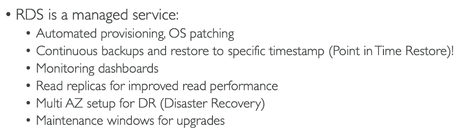
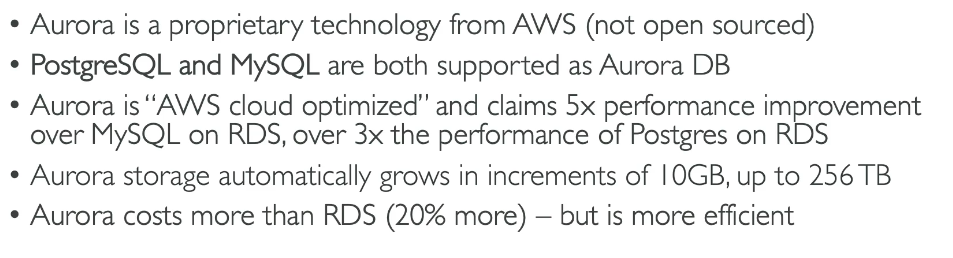
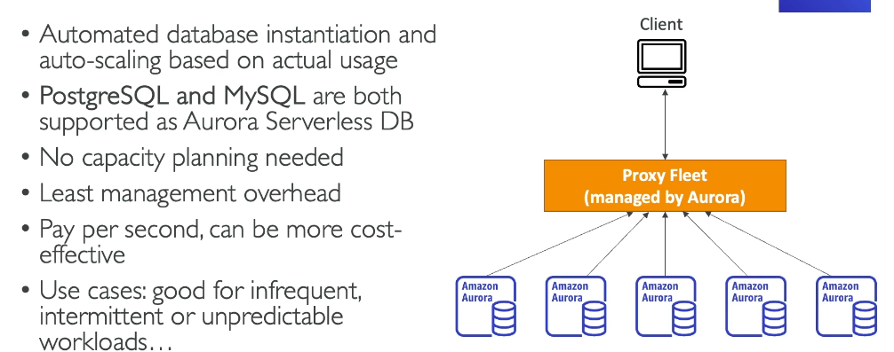
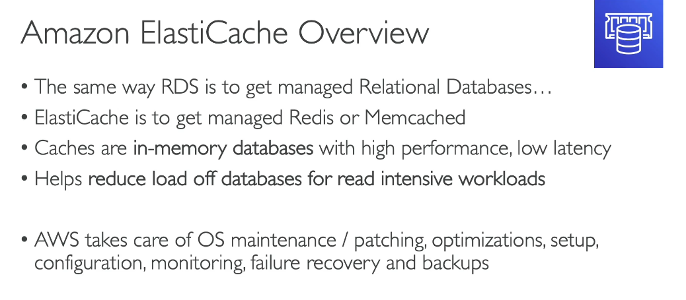
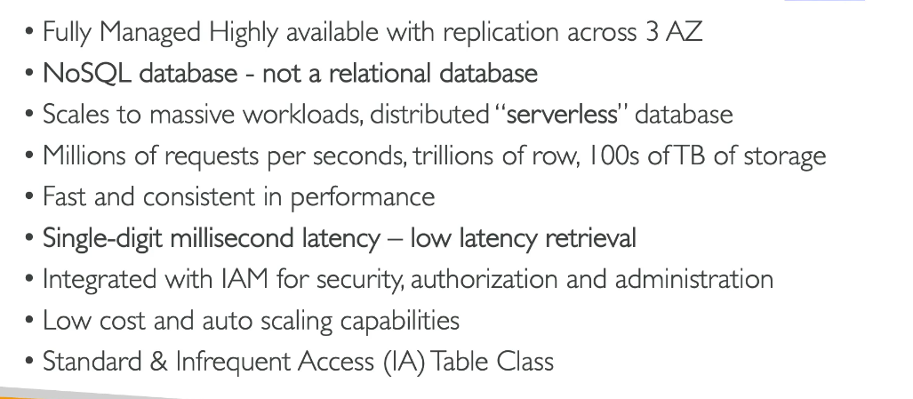
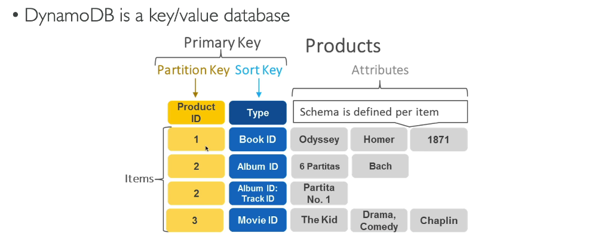
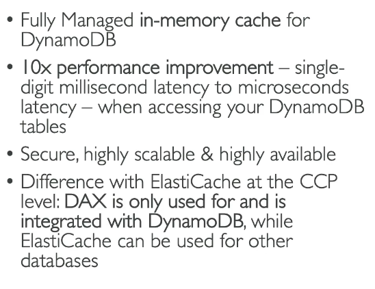
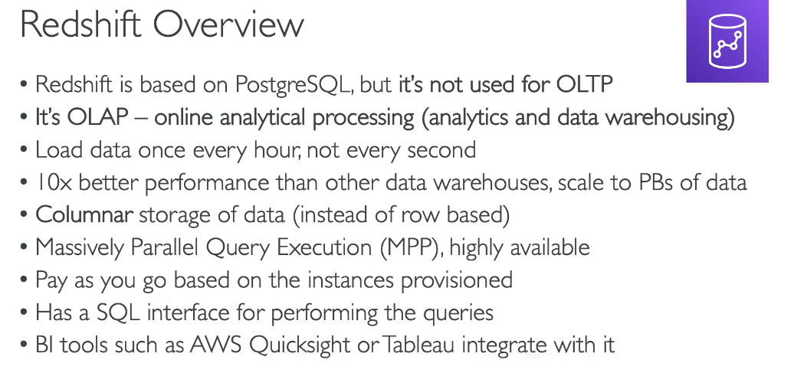
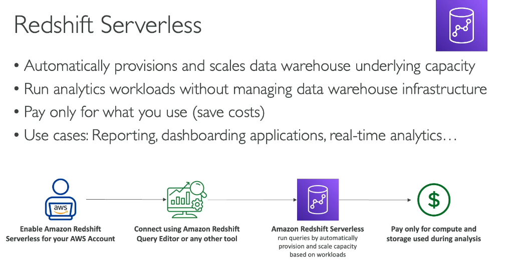

# Databases and Analytics

> CLF-C02 focus: selecting managed relational, NoSQL, caching, graph, document, warehouse, and analytics services for common use cases.

## Choosing a data service

| Requirement | Best starting service |
| --- | --- |
| Managed relational SQL database | Amazon RDS |
| AWS-built MySQL- or PostgreSQL-compatible relational database | Amazon Aurora |
| Serverless key-value or document database at massive scale | Amazon DynamoDB |
| In-memory cache for microsecond or low-millisecond access | Amazon ElastiCache |
| MongoDB-compatible document database | Amazon DocumentDB |
| Highly connected relationship data | Amazon Neptune |
| Cloud data warehouse and OLAP analytics | Amazon Redshift |
| Run SQL directly against data in S3 | Amazon Athena |

The exam normally tests the service-to-use-case match rather than database administration commands.

## Amazon RDS

Amazon Relational Database Service (Amazon RDS) is a managed service for relational databases using SQL.

Supported database engines include MySQL, MariaDB, PostgreSQL, Oracle Database, Microsoft SQL Server, and IBM Db2. Aurora is accessed through the RDS family but uses an AWS-built engine and architecture.

AWS handles tasks such as infrastructure provisioning, database software installation, patching, automated backups, monitoring integration, and hardware replacement. You still manage schemas, queries, database users, network access, and application design. You cannot SSH into the underlying RDS host.

### Multi-AZ versus read replicas

| Feature | Main purpose | Can it normally serve reads? | Replication |
| --- | --- | --- | --- |
| RDS Multi-AZ standby | High availability and automatic failover | No | Synchronous |
| RDS read replica | Scale read-heavy workloads | Yes | Asynchronous |

This distinction is highly testable. Multi-AZ improves availability; a read replica improves read scalability. A read replica can also be promoted, but it is not the automatic standby used by a standard Multi-AZ deployment.

## Amazon Aurora

Aurora is a fully managed relational database engine compatible with MySQL and PostgreSQL. Its distributed storage automatically grows and keeps copies across three Availability Zones.

Aurora provides high availability, automated backups, fast failover, and read scaling. Aurora Serverless can automatically adjust database compute capacity for intermittent, variable, or unpredictable workloads.

Do not memorize performance multipliers or price percentages from older course material. Know that Aurora is AWS-built, relational, MySQL/PostgreSQL-compatible, highly available, and available in provisioned and serverless configurations.

## Amazon ElastiCache

Amazon ElastiCache is a managed in-memory cache supporting Valkey, Redis OSS, and Memcached.

Use it to reduce database load and improve latency for frequently accessed data, session state, leaderboards, and similar cache-friendly workloads. A cache improves speed but is not automatically the authoritative long-term database.

## Amazon DynamoDB

DynamoDB is a serverless, fully managed, distributed NoSQL database supporting key-value and document data models. It is designed for consistent single-digit millisecond performance at virtually any scale.

### Keys and capacity

- A **partition key** determines where an item is stored.
- A table can use a partition key alone or a composite primary key containing a partition key and sort key.
- **On-demand capacity** automatically handles changing traffic and charges per request.
- **Provisioned capacity** uses configured read and write capacity and can use auto scaling.

### DynamoDB Accelerator and global tables

DynamoDB Accelerator (DAX) is a fully managed, DynamoDB-compatible in-memory cache that can reduce repeated-read latency from milliseconds to microseconds.

DynamoDB global tables provide managed multi-Region, multi-active replication. Applications can read and write through replicas in multiple Regions.

## Specialized databases

| Service | Data model and use case |
| --- | --- |
| Amazon DocumentDB | Fully managed document database compatible with MongoDB APIs |
| Amazon Neptune | Graph database optimized for relationships such as social graphs, fraud detection, and knowledge graphs |

The source also mentions Amazon Timestream for time-series data and Amazon Managed Blockchain. They are useful recognition terms, but they are not on the current official CLF-C02 in-scope service list, so they are lower study priority.

## Amazon Redshift

Amazon Redshift is a managed cloud data warehouse for online analytical processing (OLAP), reporting, and business intelligence. It uses columnar storage and parallel processing for analytics over large datasets; it is not intended to replace an operational transaction database.

Redshift Serverless automatically provisions and scales data warehouse capacity and charges for capacity used.

## Analytics services

| Service | Primary purpose |
| --- | --- |
| Amazon Athena | Serverless interactive SQL queries directly against data in Amazon S3 |
| Amazon EMR | Managed platform for big-data frameworks such as Apache Spark and Hadoop |
| AWS Glue | Serverless data integration, extract-transform-load (ETL), crawlers, and a centralized Data Catalog |
| Amazon Quick Sight | Managed business intelligence, visualizations, reports, and dashboards; evolved from Amazon QuickSight and is now a capability within Amazon Quick |
| Amazon OpenSearch Service | Search, log analytics, and application monitoring use cases |
| Amazon Kinesis | Collect and process real-time streaming data; owned by the Cloud Integrations chapter |

### Common analytics flow

One common pattern is:

1. Store raw data in S3.
2. Use an AWS Glue crawler to discover its schema and place metadata in the Glue Data Catalog.
3. Transform the data with Glue or process it with EMR.
4. Query data in place with Athena or load it into Redshift.
5. Build dashboards with Amazon Quick Sight.

This is an example, not a required fixed architecture.

## AWS Database Migration Service

AWS Database Migration Service (AWS DMS) migrates data between supported databases with minimal downtime. The source and target can be on premises, on EC2, or managed AWS databases.

- A **homogeneous migration** uses the same or compatible database engines.
- A **heterogeneous migration** uses different engines and may require AWS Schema Conversion Tool or another schema-conversion process.
- DMS can perform a one-time migration and continue replicating changes while applications remain active.

DMS is defined here so the later Migration chapter can focus on overall migration strategies rather than repeat database migration mechanics.

## Exam memory checks

1. **Which managed service runs common relational database engines?** Amazon RDS.
2. **What is the difference between RDS Multi-AZ and a read replica?** Multi-AZ is mainly for high availability; read replicas scale reads.
3. **Which engines is Aurora compatible with?** MySQL and PostgreSQL.
4. **Which service is a serverless NoSQL key-value and document database?** DynamoDB.
5. **What accelerates repeated DynamoDB reads?** DAX.
6. **Which service provides a managed in-memory cache?** ElastiCache.
7. **Which service is a cloud data warehouse?** Redshift.
8. **Which service runs serverless SQL queries against S3?** Athena.
9. **Which service provides serverless ETL and a Data Catalog?** AWS Glue.
10. **Which service migrates databases with minimal downtime?** AWS DMS.

## Avoiding duplication in later chapters

- EBS, EFS, FSx, and storage fundamentals: [EBS and EC2 Storage](04-ebs-and-ec2-storage.md)
- S3 data lakes and storage classes: [Amazon S3 and Hybrid Storage](07-amazon-s3-and-hybrid-storage.md)
- Kinesis streaming mechanics: [Cloud Integrations](11-cloud-integrations.md)
- VPC subnets and database security groups: Networking
- Backups, RTO, RPO, and disaster recovery strategies: Backup and Disaster Recovery
- Database pricing and Reserved Instances: Billing and Pricing

## References

- [What is Amazon RDS?](https://docs.aws.amazon.com/AmazonRDS/latest/UserGuide/)
- [Amazon RDS read replicas](https://docs.aws.amazon.com/AmazonRDS/latest/UserGuide/USER_ReadRepl.html)
- [What is Amazon Aurora?](https://docs.aws.amazon.com/AmazonRDS/latest/AuroraUserGuide/CHAP_AuroraOverview.html)
- [What is Amazon DynamoDB?](https://docs.aws.amazon.com/amazondynamodb/latest/developerguide/Introduction.html)
- [Amazon ElastiCache engines](https://docs.aws.amazon.com/AmazonElastiCache/latest/dg/WhatIs.corecomponents.html)
- [Amazon Redshift Serverless](https://docs.aws.amazon.com/redshift/latest/mgmt/working-with-serverless.html)
- [What is Amazon Athena?](https://docs.aws.amazon.com/athena/latest/ug/)
- [What is AWS Glue?](https://docs.aws.amazon.com/glue/latest/dg/)
- [What is Amazon EMR?](https://docs.aws.amazon.com/emr/latest/ManagementGuide/)
