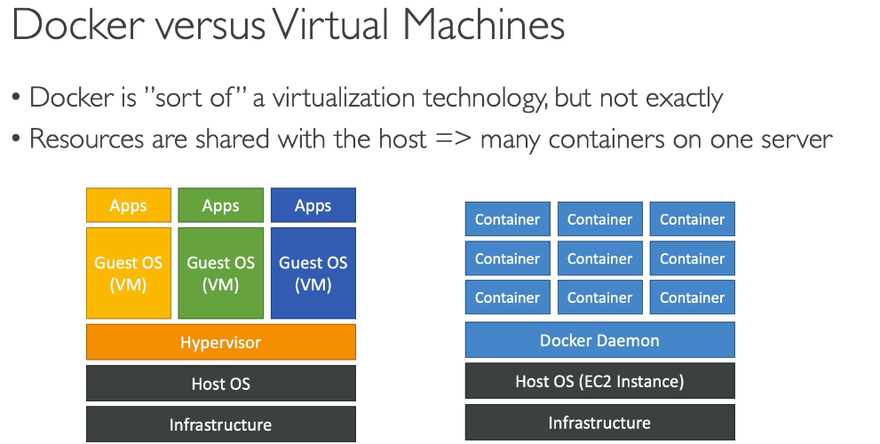
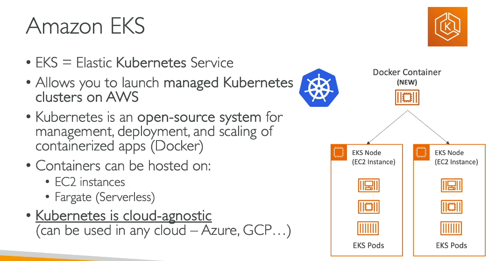
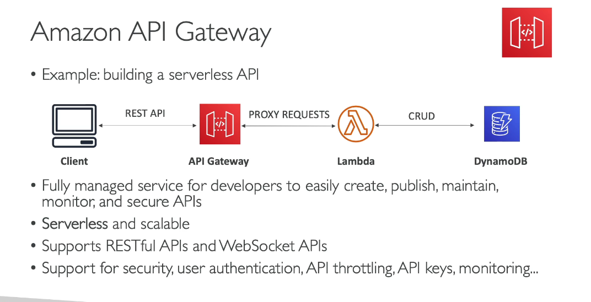
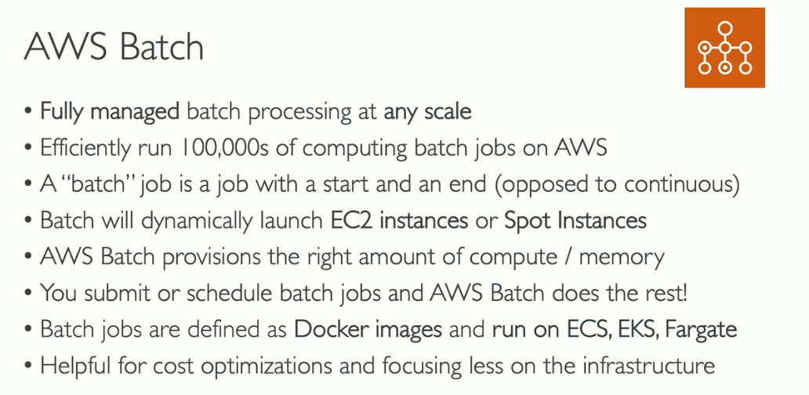
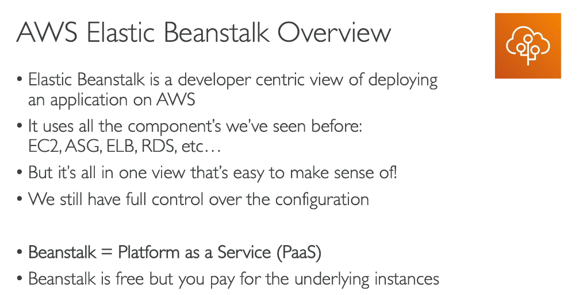
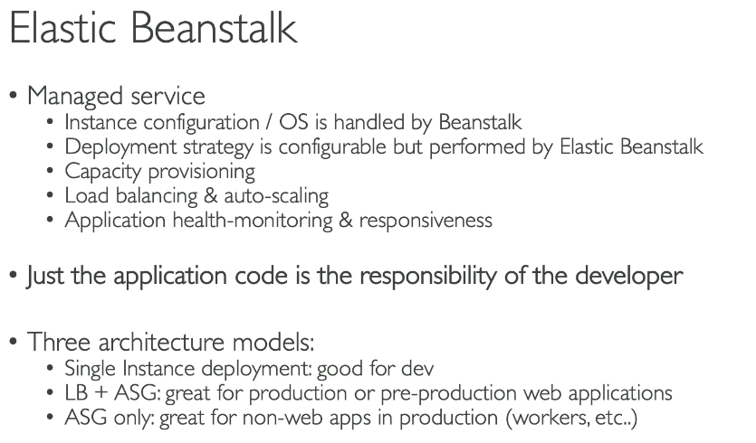
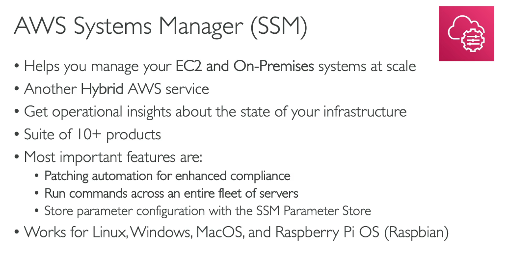
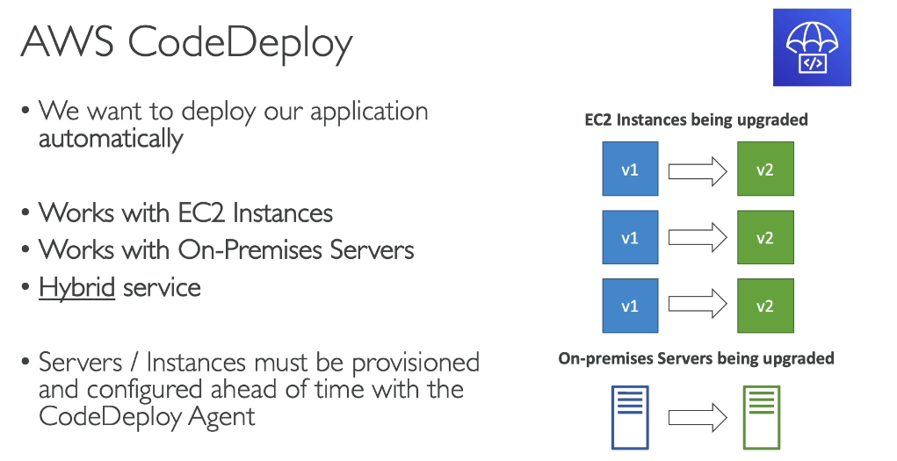

# Other Compute Services

> CLF-C02 focus: containers, serverless compute, managed application platforms, batch workloads, APIs, systems management, and deployment services.

## Compute choices at a glance

| Need | Best starting service |
| --- | --- |
| Full control of a virtual server | Amazon EC2 |
| Simplified virtual private server | Amazon Lightsail |
| Run event-driven code without managing servers | AWS Lambda |
| Package and run containers with AWS orchestration | Amazon ECS |
| Run managed Kubernetes | Amazon EKS |
| Serverless compute for ECS or EKS containers | AWS Fargate |
| Deploy a web application while AWS provisions the environment | AWS Elastic Beanstalk |
| Schedule and run batch jobs at scale | AWS Batch |

EC2 fundamentals are already covered in [Amazon EC2](03-ec2.md). This chapter focuses on when another compute abstraction is a better fit.

## Containers

A container packages application code and dependencies while sharing the host operating system kernel. A virtual machine includes a full guest operating system.

Containers normally start faster and use fewer resources than full virtual machines, but they still require orchestration, networking, security, and storage choices.

### Amazon ECR

Amazon Elastic Container Registry (Amazon ECR) is a managed container image registry. It stores, manages, scans, and distributes container images used by services such as ECS and EKS.

### Amazon ECS

Amazon Elastic Container Service (Amazon ECS) is AWS's native container orchestration service. It schedules and manages containers as tasks and services.

ECS can use:

- **EC2 launch type:** You manage the EC2 instances forming the cluster.
- **AWS Fargate:** AWS manages the underlying compute capacity.

### Amazon EKS

Amazon Elastic Kubernetes Service (Amazon EKS) is a managed Kubernetes service. Use it when an application or organization needs the Kubernetes API and ecosystem.

EKS manages the Kubernetes control plane. Workloads can run on managed EC2 nodes or on Fargate.

### AWS Fargate

AWS Fargate is serverless compute for containers. You define the container resources and task or pod; AWS provisions and manages the underlying servers. Fargate works with ECS and EKS and is not a separate container orchestrator.

### ECS versus EKS versus Fargate

| Service | Main job |
| --- | --- |
| ECR | Store container images |
| ECS | Orchestrate containers using AWS-native APIs |
| EKS | Orchestrate containers using Kubernetes |
| Fargate | Supply serverless compute capacity for ECS tasks or EKS pods |

## AWS Lambda

AWS Lambda runs code in response to events without requiring you to provision or manage servers.

- Upload code as a function and configure triggers.
- Lambda automatically scales by running more function environments as requests increase.
- Common triggers include API Gateway, S3, EventBridge, DynamoDB Streams, and SQS.
- It fits short-lived, event-driven processing rather than a continuously running traditional server.
- AWS manages the servers, operating system, capacity provisioning, and infrastructure patching; you manage the function code, dependencies, permissions, and configuration.

"Serverless" means server management is abstracted from the customer, not that no servers exist.

## Amazon API Gateway

Amazon API Gateway is a managed service for creating, publishing, securing, throttling, monitoring, and maintaining APIs. It supports REST, HTTP, and WebSocket APIs and commonly provides a front door for Lambda functions or HTTP backends.

API Gateway manages the API endpoint and request handling; Lambda supplies compute for the business logic. They are separate services that are often used together.

## AWS Batch

AWS Batch schedules batch jobs and dynamically provisions appropriate compute resources. A batch job has a defined start and finish, unlike a continuously running web service.

Use it for scientific processing, rendering, financial modeling, media processing, or other queued jobs. Batch can run containerized jobs on supported managed compute environments without requiring you to build a custom scheduler.

## AWS Elastic Beanstalk

Elastic Beanstalk is a managed application platform. You upload application code; Elastic Beanstalk provisions and coordinates resources such as EC2, Auto Scaling, Elastic Load Balancing, and monitoring.

You retain control of the underlying resources and pay for those resources; there is no additional charge for the Elastic Beanstalk service itself.

Elastic Beanstalk is useful when developers want to deploy a supported web application without manually assembling every infrastructure component.

## Amazon Lightsail

Amazon Lightsail provides simplified bundles of compute, storage, networking, and predictable monthly pricing. It fits small websites, prototypes, blogs, and simple business applications when the full flexibility of EC2 is unnecessary.

## AWS Systems Manager

AWS Systems Manager provides operational tools for EC2 instances and managed nodes in hybrid and multicloud environments.

Important capabilities include:

| Capability | Purpose |
| --- | --- |
| Session Manager | Auditable shell access without opening inbound SSH or RDP ports |
| Run Command | Run commands securely across managed nodes |
| Patch Manager | Scan for and install operating system patches |
| State Manager | Keep managed nodes in a defined configuration state |
| Inventory | Collect software and configuration metadata |
| Parameter Store | Store hierarchical configuration values and encrypted parameters |

Session Manager was introduced in the EC2 chapter; the broader operational suite belongs here.

## Developer and deployment services

| Service | Purpose |
| --- | --- |
| AWS CodeCommit | Managed Git source repository |
| AWS CodeBuild | Fully managed build and test service |
| AWS CodePipeline | Orchestrates continuous delivery pipeline stages |
| AWS CodeDeploy | Automates deployments to EC2, on-premises servers, Lambda, and ECS |
| AWS CodeArtifact | Managed artifact and software package repository |

Do not confuse the stages: CodeCommit stores source, CodeBuild builds and tests, CodeDeploy deploys, and CodePipeline connects release stages into a workflow.

For CLF-C02, prioritize CodeBuild and CodePipeline. The official guide explicitly places CodeDeploy and CodeArtifact out of scope; CodeCommit is not named on its in-scope list.

Infrastructure as code with CloudFormation is covered in [Other Services, Backup, and Migration](18-other-services-backup-and-migration.md).

## Exam memory checks

1. **Which service stores container images?** Amazon ECR.
2. **What is the difference between ECS and EKS?** ECS uses AWS-native container orchestration; EKS provides managed Kubernetes.
3. **What does Fargate provide?** Serverless compute for ECS containers and EKS pods.
4. **Which service runs event-driven functions without server management?** AWS Lambda.
5. **Which service creates managed REST, HTTP, or WebSocket APIs?** API Gateway.
6. **Which service schedules and provisions resources for batch jobs?** AWS Batch.
7. **Which service deploys application code and provisions an environment using EC2, ELB, and Auto Scaling?** Elastic Beanstalk.
8. **Which Systems Manager capability gives shell access without opening inbound administration ports?** Session Manager.
9. **Which service orchestrates continuous delivery stages?** CodePipeline.

## Avoiding duplication in later chapters

- EC2 instances and instance families: [Amazon EC2](03-ec2.md)
- ELB and Auto Scaling mechanics: [Elastic Load Balancing and EC2 Auto Scaling](06-elastic-load-balancing-and-auto-scaling.md)
- Event-driven messaging and queues: [Cloud Integrations](11-cloud-integrations.md)
- CloudFormation and infrastructure as code: [Other Services, Backup, and Migration](18-other-services-backup-and-migration.md)
- Lambda, Fargate, and EC2 pricing: Billing and Pricing
- ECR image security, permissions, and vulnerability scanning: Security and Compliance

## References

- [Choosing an AWS compute service](https://docs.aws.amazon.com/pdfs/decision-guides/latest/compute-on-aws-how-to-choose/compute-on-aws-how-to-choose.pdf)
- [What is AWS Lambda?](https://docs.aws.amazon.com/lambda/latest/dg/welcome.html)
- [What is Amazon ECS?](https://docs.aws.amazon.com/AmazonECS/latest/developerguide/Welcome.html)
- [What is Amazon EKS?](https://docs.aws.amazon.com/eks/latest/userguide/what-is-eks.html)
- [What is AWS Fargate?](https://docs.aws.amazon.com/AmazonECS/latest/developerguide/AWS_Fargate.html)
- [What is Amazon API Gateway?](https://docs.aws.amazon.com/apigateway/latest/developerguide/welcome.html)
- [What is AWS Systems Manager?](https://docs.aws.amazon.com/systems-manager/latest/userguide/what-is-systems-manager.html)
- [What is AWS CodePipeline?](https://docs.aws.amazon.com/codepipeline/latest/userguide/welcome.html)
