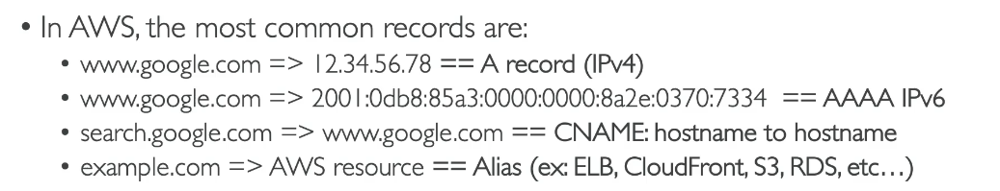
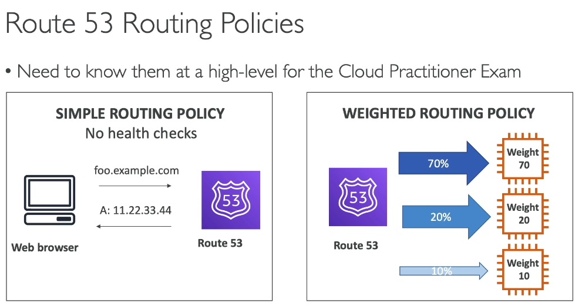
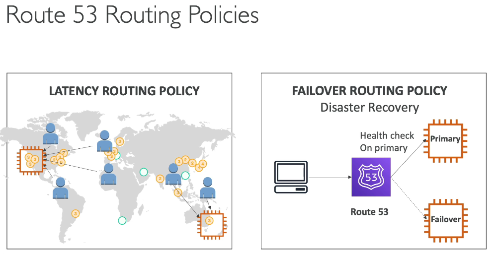
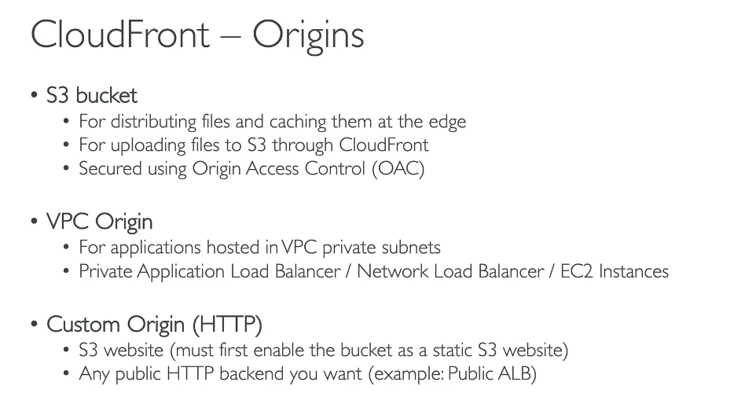
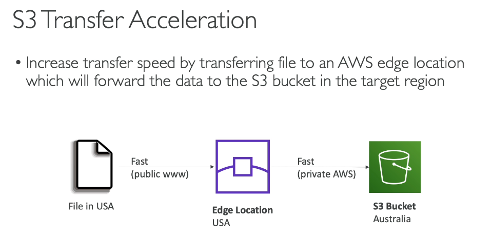
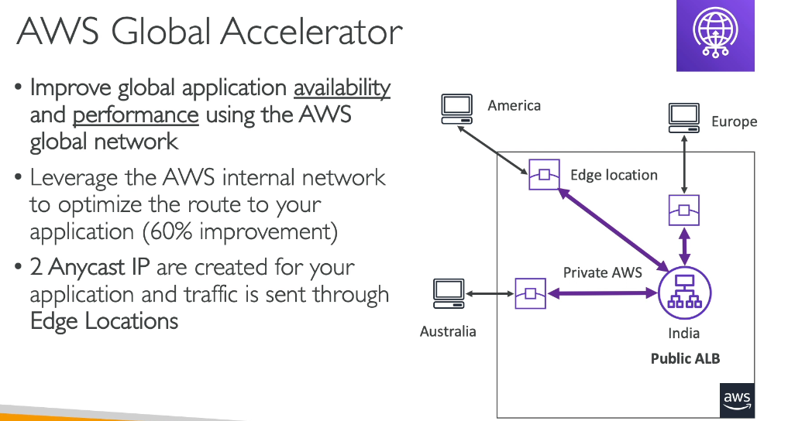
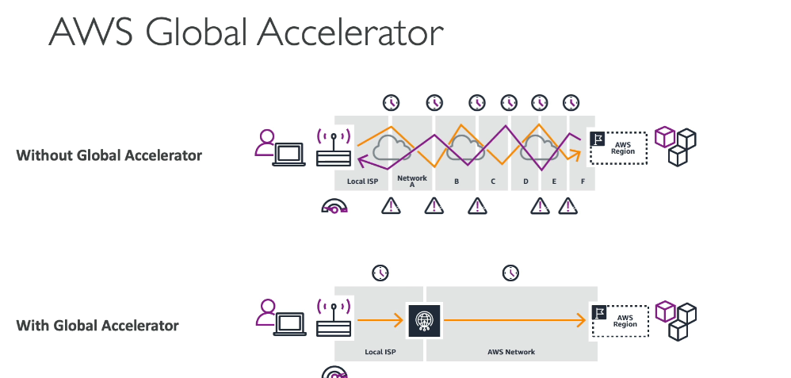
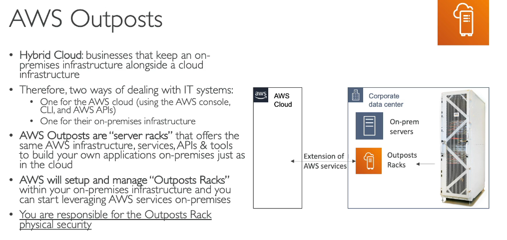
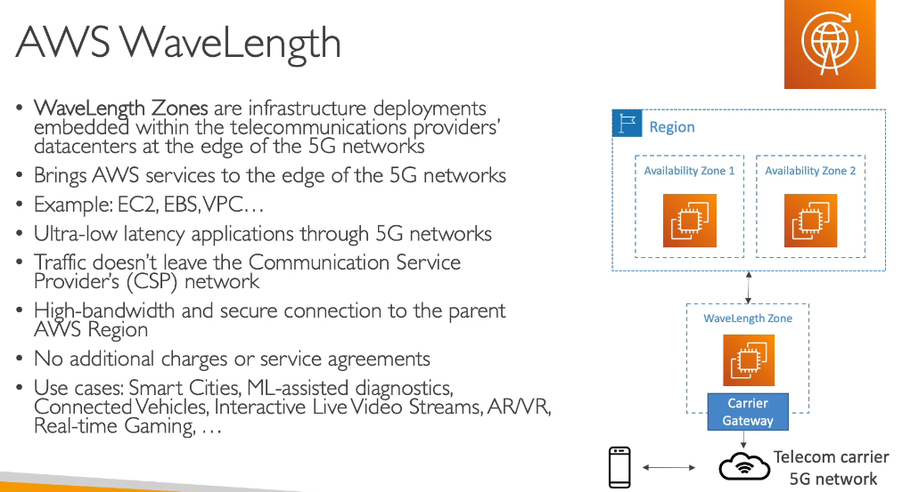
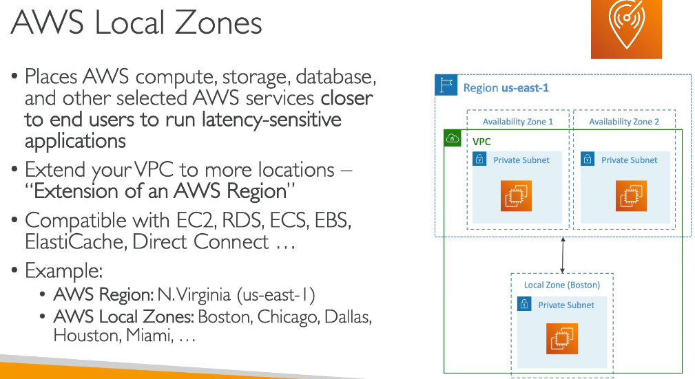

# Global Infrastructure and Edge Services

> CLF-C02 focus: DNS routing, content delivery, network acceleration, hybrid AWS hardware, and low-latency edge infrastructure.

Regions, Availability Zones, and edge locations are introduced in [Cloud Computing](01-cloud-computing.md). This chapter applies those locations to AWS networking and hybrid services without redefining them.

## Amazon Route 53

Amazon Route 53 is a highly available managed Domain Name System (DNS) service. It can register domain names, host DNS records, perform health checks, and route users to application endpoints.

### Common record types

| Record | Purpose |
| --- | --- |
| A | Maps a name to an IPv4 address |
| AAAA | Maps a name to an IPv6 address |
| CNAME | Maps one name to another name; not used at the DNS zone apex |
| Alias | AWS-specific record that routes to supported AWS resources, including the zone apex |

Public hosted zones answer DNS queries from the internet. Private hosted zones provide DNS inside associated VPCs.

### Routing policies

| Policy | Routing decision |
| --- | --- |
| Simple | Route to one resource or a basic set of records |
| Weighted | Split traffic according to assigned weights |
| Latency | Route to the AWS Region providing the best measured latency |
| Failover | Active-passive routing based on health checks |
| Geolocation | Route based on the user's geographic location |
| Geoproximity | Route based on resource/user location and optional traffic bias |
| Multivalue answer | Return multiple healthy records selected from a set |

Route 53 routing is DNS-based. It does not proxy every application request like a load balancer.

## Amazon CloudFront

Amazon CloudFront is a content delivery network (CDN). It caches and delivers HTTP/HTTPS content through edge locations closer to users, reducing latency and load on the origin.

An **origin** is the source of the content. Common origins include:

- An S3 bucket
- An Application Load Balancer
- An EC2-hosted web application
- API Gateway or another supported AWS origin
- A custom HTTP server outside AWS

For private S3 content, CloudFront Origin Access Control allows CloudFront to retrieve objects while the bucket remains private. CloudFront can also terminate HTTPS, apply AWS WAF rules, and use cache behaviors to route different URL paths to different origins.

## S3 Transfer Acceleration

S3 Transfer Acceleration speeds long-distance transfers into or out of an S3 bucket. Clients send data to a nearby AWS edge location, and AWS carries it to the bucket over the AWS global network.

It accelerates S3 object transfer; it is not a general application accelerator or a CDN.

## AWS Global Accelerator

AWS Global Accelerator improves the availability and performance of TCP and UDP applications by routing traffic from the nearest AWS edge location across the AWS global network to healthy regional endpoints.

Standard accelerators provide fixed anycast IP addresses. Endpoints can include Application Load Balancers, Network Load Balancers, EC2 instances, and Elastic IP addresses.

Unlike CloudFront, Global Accelerator does not cache application content.

## Edge-service comparison

| Requirement | Service |
| --- | --- |
| DNS name resolution and routing policies | Route 53 |
| Cache HTTP/HTTPS content near users | CloudFront |
| Speed long-distance upload or download to one S3 bucket | S3 Transfer Acceleration |
| Improve global TCP/UDP application routing with static anycast IPs | Global Accelerator |

## AWS Outposts

AWS Outposts extends AWS-managed infrastructure, services, APIs, and tools into a customer's data center or co-location site.

AWS owns and manages the Outposts hardware, while the customer supplies the physical site, power, cooling, and connectivity. Use Outposts for workloads requiring local data processing, low latency to on-premises systems, or residency on customer premises while retaining an AWS operating model.

## AWS Wavelength

AWS Wavelength places selected AWS compute and storage services inside telecommunications providers' 5G networks for ultra-low-latency mobile and connected-device applications.

Example use cases include interactive video, connected vehicles, augmented reality, and other latency-sensitive 5G applications.

## AWS Local Zones

AWS Local Zones place selected AWS services closer to a metropolitan area than the parent Region.

Use Local Zones for applications needing single-digit-millisecond latency to users in a particular city while remaining connected to a parent AWS Region.

## Location comparison

| Location/service | Where it runs | Main reason to use it |
| --- | --- | --- |
| AWS Region | Separate geographic area | Full regional AWS service footprint |
| Availability Zone | Isolated location inside a Region | High availability and fault isolation |
| Edge location | AWS point of presence near users | Content delivery, DNS, and network entry |
| Local Zone | AWS infrastructure near a metro area | Low latency to local users |
| Wavelength Zone | AWS infrastructure in a telecom 5G network | Ultra-low latency to 5G devices |
| Outposts | AWS-managed hardware at the customer site | Local processing and hybrid AWS operation |

## Active-active and active-passive

- **Active-active:** Multiple locations serve traffic simultaneously.
- **Active-passive:** A primary location serves traffic and a standby takes over after failure.

Route 53 health checks and failover routing can support these patterns. Full disaster recovery strategies, RTO, and RPO are intentionally reserved for the Backup and Disaster Recovery chapter.

## Exam memory checks

1. **Which service provides managed DNS?** Route 53.
2. **Which Route 53 policy splits traffic by percentage-like weights?** Weighted routing.
3. **Which Route 53 policy supports active-passive recovery?** Failover routing.
4. **Which service caches HTTP content at edge locations?** CloudFront.
5. **Which service accelerates transfers specifically to S3?** S3 Transfer Acceleration.
6. **Which service provides global static anycast IP addresses and optimized TCP/UDP routing?** Global Accelerator.
7. **Which service installs AWS-managed infrastructure at a customer site?** Outposts.
8. **Which location brings AWS services closer to a metropolitan area?** A Local Zone.
9. **Which location targets ultra-low-latency 5G applications?** A Wavelength Zone.

## Avoiding duplication in later chapters

- Region, AZ, and edge-location definitions: [Cloud Computing](01-cloud-computing.md)
- ALB, NLB, and target health checks: [Elastic Load Balancing and EC2 Auto Scaling](06-elastic-load-balancing-and-auto-scaling.md)
- S3 storage and bucket security: [Amazon S3 and Hybrid Storage](07-amazon-s3-and-hybrid-storage.md)
- VPCs, subnets, internet gateways, VPN, and Direct Connect: Networking
- AWS WAF and CloudFront security: Security and Compliance
- Active-active, active-passive, RTO, and RPO: Backup and Disaster Recovery

## References

- [Route 53 routing policies](https://docs.aws.amazon.com/Route53/latest/DeveloperGuide/routing-policy.html)
- [What is Amazon CloudFront?](https://docs.aws.amazon.com/AmazonCloudFront/latest/DeveloperGuide/Introduction.html)
- [S3 Transfer Acceleration](https://docs.aws.amazon.com/AmazonS3/latest/userguide/transfer-acceleration.html)
- [What is AWS Global Accelerator?](https://docs.aws.amazon.com/global-accelerator/latest/dg/what-is-global-accelerator.html)
- [What is AWS Outposts?](https://docs.aws.amazon.com/outposts/latest/userguide/what-is-outposts.html)
- [Extend a VPC to a Local Zone, Wavelength Zone, or Outpost](https://docs.aws.amazon.com/vpc/latest/userguide/Extend_VPCs.html)
