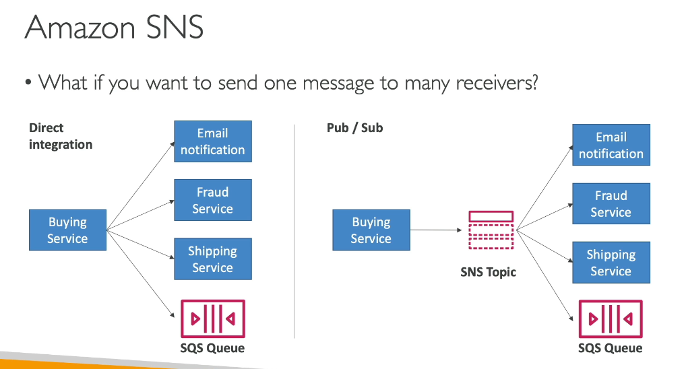
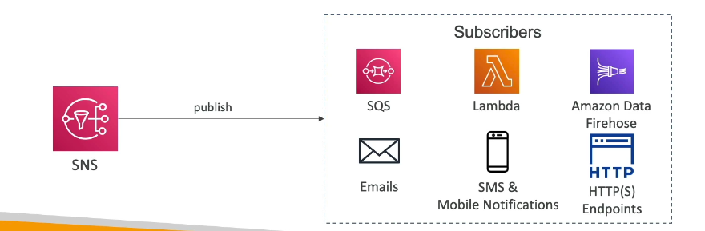
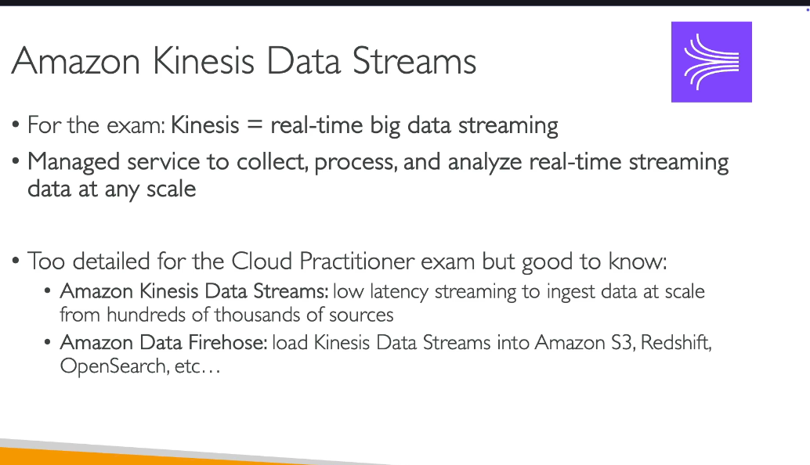
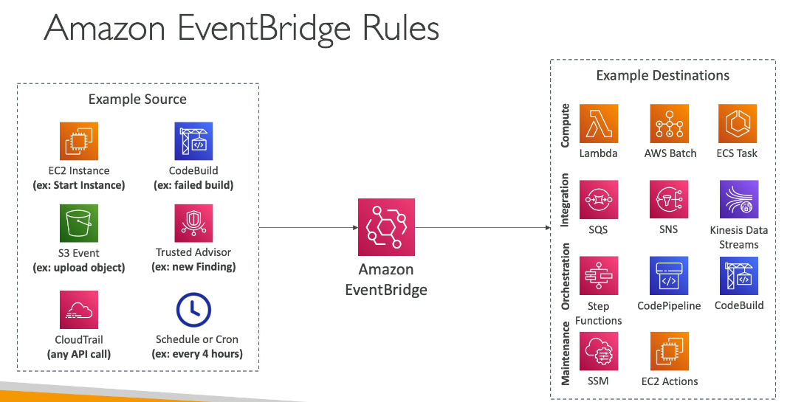

# Cloud Integrations

> CLF-C02 focus: decoupling applications with queues, topics, events, streams, and managed message brokers.

## Why integrate asynchronously?

Direct synchronous connections can tightly couple application components. Queues and event services let producers submit work without requiring every consumer to be available at that moment.

Benefits include:

- Independent scaling of producers and consumers
- Buffering traffic spikes
- Improved fault isolation
- Easier fanout to multiple consumers
- Event-driven application designs

## Amazon SQS

Amazon Simple Queue Service (Amazon SQS) is a managed message queue used to decouple distributed components.

A producer sends a message to a queue. A consumer polls the queue, processes the message, and deletes it. While being processed, the message is temporarily hidden by a **visibility timeout**. Failed messages can be moved to a **dead-letter queue** for investigation.

| Queue type | Behavior |
| --- | --- |
| Standard | Very high throughput, at-least-once delivery, and best-effort ordering |
| FIFO | Preserves order within message groups and supports exactly-once processing semantics |

Use SQS when work should wait durably until a consumer is ready. Consumers pull messages from the queue.

## Amazon SNS

Amazon Simple Notification Service (Amazon SNS) is a managed publish/subscribe service. Publishers send a message to a topic, and SNS pushes copies to subscribed endpoints.

Subscribers can include SQS queues, Lambda functions, HTTP/S endpoints, email, SMS, mobile push, and Amazon Data Firehose.

An SNS topic can fan out one event to multiple SQS queues. Each queue then buffers an independent copy for its consumer.

> [!NOTE]
> The source says "SNS: Kafka." That is incorrect. SNS is managed publish/subscribe messaging. Amazon Managed Streaming for Apache Kafka (Amazon MSK) is AWS's managed Kafka service.

## Amazon Kinesis

Amazon Kinesis handles real-time streaming data such as application logs, clickstreams, market feeds, telemetry, and IoT events.

### Kinesis Data Streams

Kinesis Data Streams durably collects ordered streams of records that one or more consumer applications can process in near real time.

Use it when applications need to process a continuous stream, preserve records for a retention period, or allow multiple consumers to read the same data independently.

### Amazon Data Firehose

Amazon Data Firehose delivers streaming data to destinations such as S3, Redshift, OpenSearch Service, and supported third-party endpoints. It manages batching, scaling, and delivery.

The exam-level distinction is:

- **Kinesis Data Streams:** Applications read and process a durable real-time stream.
- **Amazon Data Firehose:** Managed delivery of streaming data to a destination.

## Amazon EventBridge

Amazon EventBridge is a serverless event-routing service for event-driven applications. An event bus receives events from AWS services, custom applications, or supported SaaS partners. Rules match events and route them to targets.

Targets can include Lambda, Step Functions, SNS, SQS, Kinesis, ECS tasks, and other AWS services.

EventBridge also provides:

- **EventBridge Scheduler:** One-time or recurring invocations using schedules.
- **EventBridge Pipes:** Point-to-point integrations with optional filtering, transformation, and enrichment.

EventBridge owns event routing in this chapter. The Monitoring chapter only references it as a destination for operational and audit events.

## Amazon MQ

Amazon MQ is a managed message broker for Apache ActiveMQ Classic and RabbitMQ. It supports standard messaging protocols and helps migrate existing broker-based applications without rewriting them to use cloud-native queue APIs.

Use Amazon MQ when compatibility with existing broker protocols or messaging code is important. For new cloud-native designs, SQS and SNS are often simpler and more elastic.

## Choosing an integration service

| Requirement | Service |
| --- | --- |
| Buffer work for consumers and decouple components | SQS |
| Push one message to many subscribers | SNS |
| Process an ordered real-time data stream | Kinesis Data Streams |
| Deliver streaming data to S3, Redshift, or OpenSearch | Amazon Data Firehose |
| Route application and AWS service events using rules | EventBridge |
| Retain compatibility with ActiveMQ or RabbitMQ | Amazon MQ |

## Queue, topic, stream, and event bus

| Pattern | Resource behavior |
| --- | --- |
| Queue | Messages wait until a consumer pulls and processes them |
| Topic | A published message is pushed to subscribed endpoints |
| Stream | Ordered records remain available for consumers during a retention period |
| Event bus | Rules inspect events and route matching events to targets |

## Exam memory checks

1. **Which service buffers work until a consumer is ready?** SQS.
2. **Which SQS queue type preserves ordering?** FIFO.
3. **Which service pushes one message to multiple subscribers?** SNS.
4. **How can each fanout consumer receive a durable independent copy?** Subscribe separate SQS queues to an SNS topic.
5. **Which service processes real-time ordered data streams?** Kinesis Data Streams.
6. **Which service delivers streaming data to destinations with minimal management?** Amazon Data Firehose.
7. **Which service routes events using rules?** EventBridge.
8. **Which service supports existing ActiveMQ or RabbitMQ applications?** Amazon MQ.

## Avoiding duplication in later chapters

- CloudWatch alarms sending notifications through SNS: [Cloud Monitoring and Auditing](12-cloud-monitoring-and-auditing.md)
- Lambda, ECS, and other compute targets: [Other Compute Services](09-other-compute-services.md)
- Step Functions workflow orchestration: Other Services
- IAM permissions for topics, queues, and event buses: [IAM Identity and Access](02-iam-identity-and-access.md)
- Encryption keys and detailed messaging security: Security and Compliance

## References

- [What is Amazon SQS?](https://docs.aws.amazon.com/AWSSimpleQueueService/latest/SQSDeveloperGuide/welcome.html)
- [What is Amazon SNS?](https://docs.aws.amazon.com/sns/latest/dg/welcome.html)
- [What is Amazon Kinesis Data Streams?](https://docs.aws.amazon.com/streams/latest/dev/introduction.html)
- [What is Amazon EventBridge?](https://docs.aws.amazon.com/eventbridge/latest/userguide/eb-what-is.html)
- [What is Amazon MQ?](https://docs.aws.amazon.com/amazon-mq/latest/developer-guide/welcome.html)
