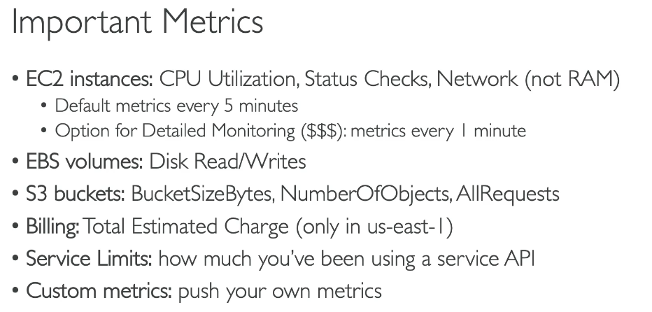
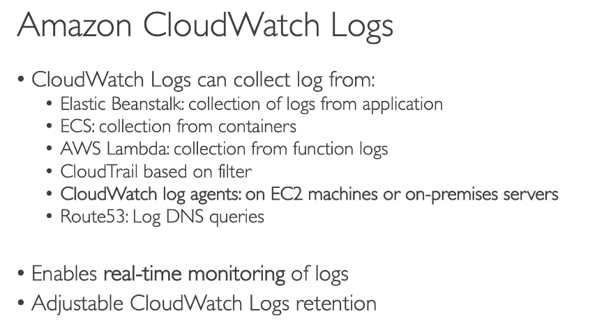
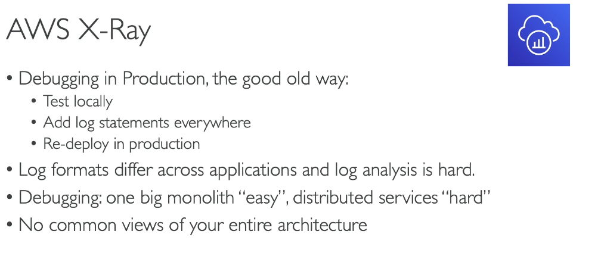
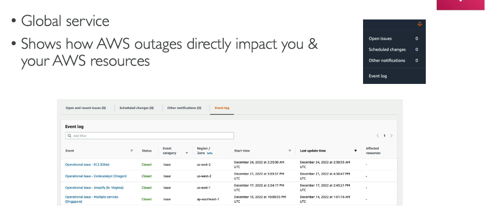

# Cloud Monitoring and Auditing

> CLF-C02 focus: metrics, dashboards, alarms, logs, API auditing, distributed tracing, events, and AWS service health.

## Observability signals

| Signal | Question it answers | Main AWS service |
| --- | --- | --- |
| Metrics | What numerical value changed over time? | Amazon CloudWatch Metrics |
| Logs | What detailed event or message was recorded? | CloudWatch Logs |
| Traces | Where did a request spend time across services? | AWS X-Ray |
| API audit events | Who performed an action, when, and through which API? | AWS CloudTrail |
| AWS service health | Is an AWS event affecting my resources or services? | AWS Health |

## Amazon CloudWatch

Amazon CloudWatch monitors AWS resources and applications. Its major exam-level features are metrics, dashboards, alarms, and logs.

### CloudWatch Metrics

A metric is a time-ordered set of numerical data points. AWS services publish many metrics automatically, and applications can publish custom metrics.

Common examples include:

| Resource | Example metrics or consideration |
| --- | --- |
| EC2 | CPU utilization, network traffic, and status checks |
| EBS | Read/write operations, throughput, and queue length |
| ELB | Request count, healthy targets, latency, and errors |
| RDS | CPU, connections, free storage, and read/write activity |
| S3 | Daily storage metrics by default; request metrics when enabled |
| Custom application | Business or application values published by the application or agent |

EC2 does not publish guest operating-system memory utilization or filesystem usage as standard host metrics. Install and configure the CloudWatch agent or publish custom metrics when those values are needed.

Basic EC2 monitoring normally publishes metrics at five-minute intervals. Detailed monitoring provides one-minute metrics for an additional charge. Pricing detail belongs in the Billing chapter.

### CloudWatch Dashboards

Dashboards display graphs, numbers, text, alarms, and other widgets in one view. Custom dashboards can combine metrics from multiple services, Regions, or accounts when cross-account observability is configured.

### CloudWatch Alarms

An alarm evaluates a metric or expression over configured periods.

| Alarm state | Meaning |
| --- | --- |
| `OK` | The metric is within the defined threshold |
| `ALARM` | The threshold has been breached |
| `INSUFFICIENT_DATA` | There is not enough data to evaluate the alarm |

Alarm actions can include:

- Sending a notification through Amazon SNS
- Performing an EC2 action such as stop, terminate, reboot, or recover
- Triggering an EC2 Auto Scaling policy
- Creating a Systems Manager OpsItem or incident

CloudWatch alarms react to monitoring data. They do not record who changed a resource; that is CloudTrail's role.

### CloudWatch Logs

CloudWatch Logs centralizes log events from AWS services, applications, EC2 instances, containers, and on-premises systems.

| Concept | Meaning |
| --- | --- |
| Log event | One timestamped log record |
| Log stream | Sequence of events from one source |
| Log group | Collection of related log streams with shared settings |
| Retention policy | Controls how long log events are kept |
| Logs Insights | Query language for searching and analyzing log data |
| Metric filter | Converts matching log patterns into CloudWatch metrics |

EC2 operating-system and application logs require an agent or application integration; CloudWatch does not automatically read every file inside an instance.

## AWS CloudTrail

AWS CloudTrail records account activity and AWS API events from the Management Console, CLI, SDKs, and AWS services.

CloudTrail helps answer questions such as:

- Who deleted this resource?
- Which identity changed this policy?
- From which IP address was an API called?
- When was a configuration action performed?

### Event history and trails

- CloudTrail Event history provides the previous 90 days of management events in each Region.
- A **trail** delivers selected events continuously to an S3 bucket and can also integrate with CloudWatch Logs and EventBridge.
- A multi-Region trail captures activity across enabled Regions and is the normal best-practice choice.
- Management events record control-plane actions; data events record high-volume resource operations such as S3 object access or Lambda invocations when configured.

CloudTrail is primarily for governance, compliance, security investigation, and auditing. It is not a performance-metric service.

## Amazon EventBridge in monitoring

AWS services can publish operational events to EventBridge. Rules can route matching events to targets such as Lambda, SNS, SQS, Systems Manager, or Step Functions.

EventBridge is defined in [Cloud Integrations](11-cloud-integrations.md). In monitoring architectures, it commonly turns a service or audit event into an automated response.

## AWS X-Ray

AWS X-Ray collects trace data about requests passing through applications and supported downstream services.

Use X-Ray to view a service map, analyze end-to-end request latency, and identify errors or bottlenecks in distributed applications and microservices.

CloudWatch shows operational metrics and logs; X-Ray follows individual requests across components.

## AWS Health Dashboard

AWS Health provides information about AWS events, planned changes, and service issues that may affect an account and its resources.

The AWS Health Dashboard includes:

- A public view of the general health of AWS services.
- An authenticated, personalized view of events affecting the account and its resources.
- Notifications and remediation guidance for scheduled maintenance and active issues.

Do not confuse AWS Health with CloudWatch. CloudWatch monitors workload telemetry; AWS Health reports AWS service and resource events.

## Service comparison

| Scenario | Correct service |
| --- | --- |
| Alert when EC2 CPU is too high | CloudWatch alarm |
| Search application error messages | CloudWatch Logs |
| Determine who called `DeleteBucket` | CloudTrail |
| Trace latency through multiple microservices | X-Ray |
| Learn whether AWS maintenance affects an RDS instance | AWS Health |
| Route a matching AWS service event to Lambda | EventBridge |
| Assess resource configuration compliance over time | AWS Config, covered later in Security and Compliance |

## Exam memory checks

1. **Which service collects operational metrics?** CloudWatch.
2. **Does EC2 publish RAM utilization as a standard metric?** No. Use the CloudWatch agent or a custom metric.
3. **What are the three traditional CloudWatch alarm states?** `OK`, `ALARM`, and `INSUFFICIENT_DATA`.
4. **Which service centralizes application and system logs?** CloudWatch Logs.
5. **Which service records AWS API activity?** CloudTrail.
6. **How far back does CloudTrail Event history normally show management events?** 90 days in each Region.
7. **Which service traces a request across distributed application components?** AWS X-Ray.
8. **Which service provides personalized notices about AWS events affecting your resources?** AWS Health.
9. **Which service routes matching events to automation targets?** EventBridge.

## Avoiding duplication in later chapters

- Auto Scaling policies triggered by metrics: [Elastic Load Balancing and EC2 Auto Scaling](06-elastic-load-balancing-and-auto-scaling.md)
- EventBridge buses, rules, Scheduler, and Pipes: [Cloud Integrations](11-cloud-integrations.md)
- AWS Config, GuardDuty, Security Hub, and security investigations: Security and Compliance
- Billing metrics, cost alarms, and AWS Budgets: Billing and Pricing
- VPC Flow Logs and network troubleshooting: Networking
- Support plans and support response times: Billing, Pricing, and Support

## References

- [Metrics in Amazon CloudWatch](https://docs.aws.amazon.com/AmazonCloudWatch/latest/monitoring/working_with_metrics.html)
- [Using CloudWatch alarms](https://docs.aws.amazon.com/AmazonCloudWatch/latest/monitoring/CloudWatch_Alarms.html)
- [What is Amazon CloudWatch Logs?](https://docs.aws.amazon.com/AmazonCloudWatch/latest/logs/WhatIsCloudWatchLogs.html)
- [CloudTrail concepts](https://docs.aws.amazon.com/awscloudtrail/latest/userguide/cloudtrail-concepts.html)
- [What is AWS X-Ray?](https://docs.aws.amazon.com/xray/latest/devguide/aws-xray.html)
- [What is AWS Health?](https://docs.aws.amazon.com/health/latest/ug/what-is-aws-health.html)
