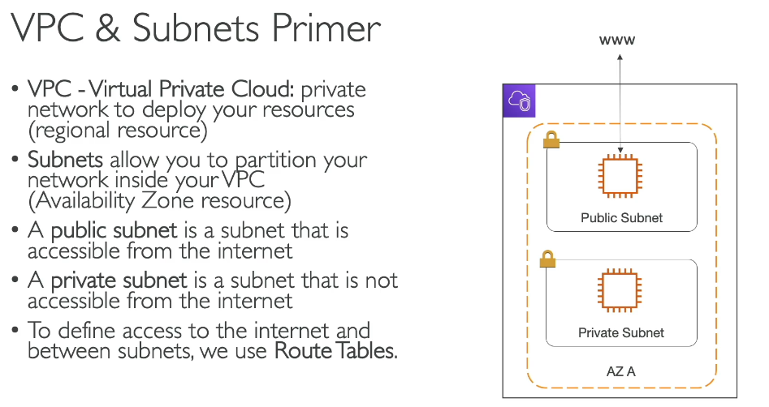
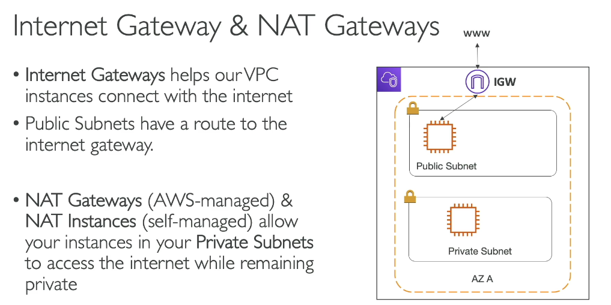
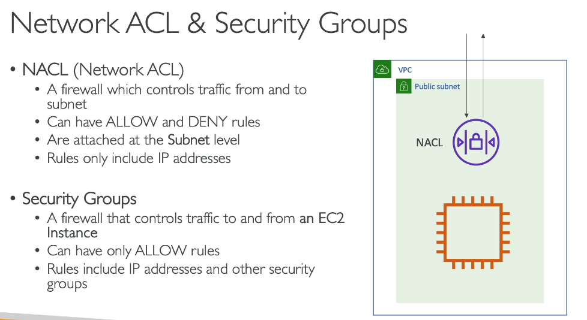
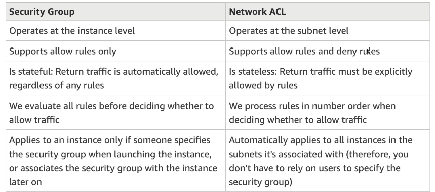
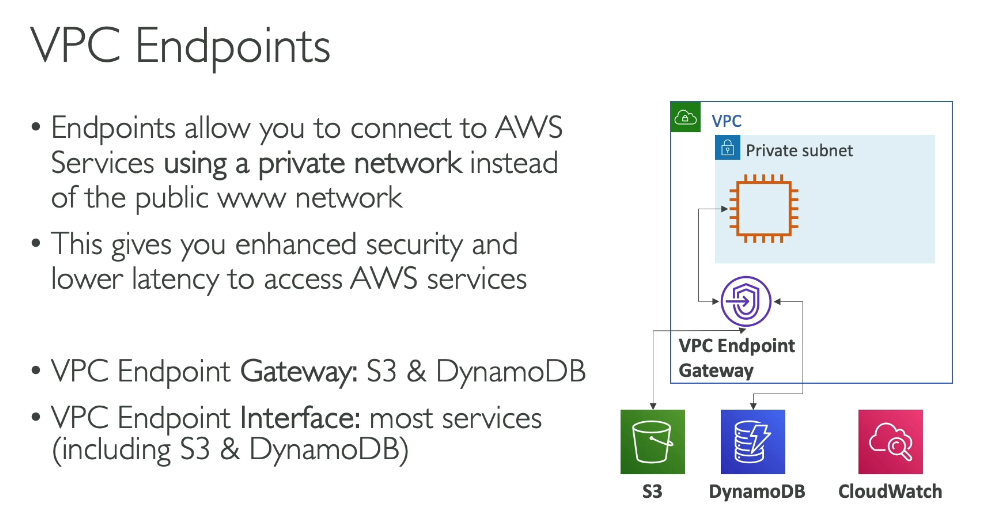
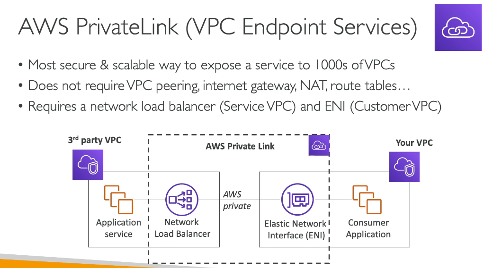
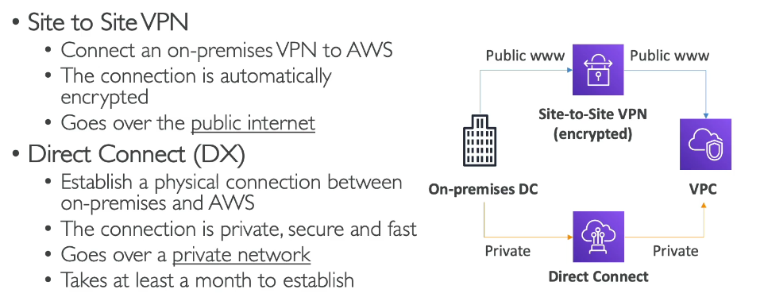
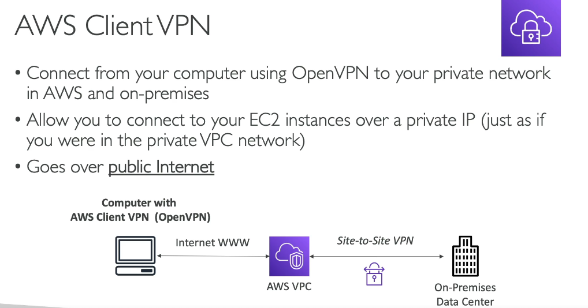
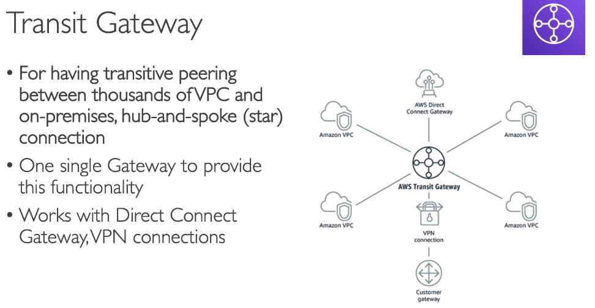

# VPC and Networking

> CLF-C02 focus: VPCs, subnets, routing, internet access, network security, private service access, hybrid connectivity, and network hubs.

## Networking mental model

Amazon Virtual Private Cloud (Amazon VPC) provides a logically isolated virtual network in AWS. You choose its IP address ranges, divide it into subnets, control routes, and apply security controls.

| Component | Main purpose |
| --- | --- |
| VPC | Regional network boundary for AWS resources |
| Subnet | IP address range in one Availability Zone |
| Route table | Decides where traffic is sent |
| Internet gateway | Connects a VPC to the internet |
| NAT gateway | Gives private-subnet resources outbound IPv4 access |
| Security group | Stateful allow-list firewall for supported resources |
| Network ACL | Stateless allow-and-deny filter at the subnet boundary |

## VPCs, subnets, and IP addresses

A VPC is created in one AWS Region and can span multiple Availability Zones. A subnet belongs to exactly one Availability Zone, so resilient applications normally use subnets in at least two AZs.

- A VPC receives one or more IPv4 or IPv6 CIDR blocks.
- A subnet receives a non-overlapping portion of the VPC address range.
- Resources normally receive private IP addresses inside the VPC.
- A public IPv4 address can change when an instance is stopped and started.
- An Elastic IP address is a static public IPv4 address allocated to an account and can be reassociated with another supported resource.
- AWS charges for public IPv4 addresses, including Elastic IP addresses. Exact prices belong in the Billing chapter.
- IPv6 addresses are globally unique. Security rules and routing still determine whether traffic can reach a resource.

## Public and private subnets

Whether a subnet is public or private is determined primarily by its routing, not by its name.

| Subnet type | Route behavior | Common resources |
| --- | --- | --- |
| Public | Has a route to an internet gateway | Internet-facing load balancers, NAT gateways, bastion hosts |
| Private | Has no direct route to an internet gateway | Application servers and databases |
| Isolated | Has no route to the internet, even through NAT | Highly restricted internal systems |

A resource in a public subnet also needs a public IPv4 or IPv6 address, suitable security rules, and a valid route before it can communicate with the internet. Placing an instance in a subnet named `public` is not enough.

## Route tables

Every subnet is associated with one route table. A route contains:

- A **destination**, such as the VPC CIDR or `0.0.0.0/0` for all IPv4 destinations.
- A **target**, such as an internet gateway, NAT gateway, VPC endpoint, peering connection, virtual private gateway, or transit gateway.

The VPC router uses the most specific matching route. Every route table includes a local route that permits routing within the VPC CIDR; security controls still decide whether the traffic is allowed.

## Internet gateway and NAT gateway

An internet gateway is attached to a VPC and supports communication between the VPC and the internet. A public subnet normally routes `0.0.0.0/0` to an internet gateway.

A public NAT gateway is normally placed in a public subnet. Private subnets route outbound IPv4 internet traffic to the NAT gateway, which then uses the internet gateway.

Key distinction:

- **Internet gateway:** Supports internet connectivity for resources with public addressing and appropriate routes and rules.
- **NAT gateway:** Lets private resources initiate outbound IPv4 connections while preventing unsolicited internet connections from being initiated directly to those resources.

For resilient production designs, deploy NAT gateways in multiple AZs and route each private subnet to a NAT gateway in the same AZ. For outbound-only IPv6 access, use an egress-only internet gateway rather than an IPv4 NAT gateway.

## Security groups and network ACLs

Security groups were introduced with EC2. This chapter owns their comparison with network ACLs.

| Characteristic | Security group | Network ACL |
| --- | --- | --- |
| Applied at | Resource or network-interface level | Subnet level |
| Rule types | Allow only | Allow and deny |
| State | Stateful | Stateless |
| Return traffic | Automatically allowed for an allowed connection | Must be explicitly allowed |
| Evaluation | All applicable rules are considered | Rules processed in number order until a match |
| Association | A resource can use multiple security groups | A subnet uses one network ACL at a time |

Use security groups as the primary resource firewall. Network ACLs can add a subnet-level defense layer, including explicit deny rules.

## VPC Flow Logs

VPC Flow Logs capture metadata about IP traffic to and from network interfaces in a VPC, subnet, or individual network interface. Records can be published to destinations such as CloudWatch Logs or Amazon S3.

Use flow logs to investigate accepted or rejected connections, diagnose security-group or network-ACL behavior, and support network monitoring. Flow logs record traffic metadata rather than application payload contents.

CloudWatch Logs and log analysis remain in [Cloud Monitoring and Auditing](12-cloud-monitoring-and-auditing.md).

## VPC endpoints

A VPC endpoint provides private connectivity to supported AWS services or endpoint services without requiring traffic to use an internet gateway or NAT gateway.

| Endpoint type | How it works | High-yield use |
| --- | --- | --- |
| Gateway endpoint | Adds service routes to selected route tables | Amazon S3 and DynamoDB |
| Interface endpoint | Creates private IP network interfaces in selected subnets and uses AWS PrivateLink | Private access to many AWS and partner services |

Gateway endpoints for S3 and DynamoDB do not use AWS PrivateLink and have no additional endpoint charge. Interface endpoints are powered by AWS PrivateLink and normally have hourly and data-processing charges.

Endpoint policies can restrict which principals, actions, and resources are allowed through an endpoint. They work together with IAM and resource policies rather than replacing them.

## AWS PrivateLink

AWS PrivateLink privately exposes a service to consumers through interface endpoints. Traffic stays on the AWS network, and consumers do not need internet access, VPC peering, or direct routing to the provider's entire network.

Use PrivateLink when consumers should access a specific service privately without connecting two complete VPC networks.

## VPC peering

VPC peering provides private IP connectivity between two VPCs. Routes must be added on both sides, CIDR ranges cannot overlap, and the connection is not transitive.

If VPC A is peered with VPC B and VPC B is peered with VPC C, VPC A cannot automatically reach VPC C through VPC B. Use Transit Gateway when many networks need hub-and-spoke connectivity.

## Hybrid and remote connectivity

### AWS Site-to-Site VPN

Site-to-Site VPN creates encrypted IPsec tunnels between an on-premises network and AWS over a network path that normally uses the public internet.

Its main components are:

- A **customer gateway device** in the customer network.
- A **customer gateway resource** in AWS representing that device.
- A **virtual private gateway** or **transit gateway** on the AWS side.

Each Site-to-Site VPN connection provides two tunnels for redundancy.

### AWS Direct Connect

AWS Direct Connect establishes a dedicated network connection between an on-premises network and an AWS Direct Connect location. It bypasses the normal internet path and can provide more consistent bandwidth and latency.

Direct Connect does not encrypt traffic by default. A VPN can be used with Direct Connect when private connectivity and IPsec encryption are both required.

### AWS Client VPN

AWS Client VPN is a managed client-based VPN for individual users. It creates encrypted connections from supported VPN clients to resources in AWS and, when routing permits, on-premises networks.

Remember the distinction:

- **Site-to-Site VPN:** Connects one network to another network.
- **Client VPN:** Connects individual user devices to a network.

## AWS Transit Gateway

AWS Transit Gateway is a Regional network transit hub that connects VPCs and on-premises networks. It replaces a complex mesh of many point-to-point connections with a hub-and-spoke design.

Attachments can include VPCs, VPN connections, Direct Connect gateways, and peering connections to other transit gateways. Transit Gateway route tables control which attachments can communicate.

## Connectivity comparison

| Requirement | Best starting answer |
| --- | --- |
| Give a public resource internet connectivity | Internet gateway |
| Give private resources outbound IPv4 internet access | NAT gateway |
| Access S3 or DynamoDB privately from a VPC | Gateway VPC endpoint |
| Access a supported service through private IP addresses | Interface endpoint / PrivateLink |
| Privately connect two VPCs directly | VPC peering |
| Connect many VPCs and on-premises networks through a hub | Transit Gateway |
| Encrypted network-to-network connection over the internet | Site-to-Site VPN |
| Dedicated connection from on premises to AWS | Direct Connect |
| Remote access for individual users | Client VPN |

## Exam memory checks

1. **Does a VPC span Availability Zones?** Yes. A VPC is Regional.
2. **Does a subnet span Availability Zones?** No. A subnet belongs to one AZ.
3. **What makes a subnet public?** Its route table has a route to an internet gateway.
4. **Does a public subnet automatically make every instance internet reachable?** No. Addressing, routes, and security rules must also allow it.
5. **Which service gives private resources outbound IPv4 internet access?** A NAT gateway.
6. **Are security groups stateful?** Yes.
7. **Can network ACLs explicitly deny traffic?** Yes.
8. **Which endpoints are designed for S3 and DynamoDB route-table access?** Gateway endpoints.
9. **Which technology powers interface endpoints?** AWS PrivateLink.
10. **Which service connects an on-premises network to AWS using encrypted tunnels?** Site-to-Site VPN.
11. **Which service provides a dedicated network path to AWS?** Direct Connect.
12. **Which service acts as a hub for many VPC and hybrid connections?** Transit Gateway.

## Avoiding duplication in other chapters

- Basic EC2 security-group rules: [Amazon EC2](03-ec2.md)
- ALB security-group flow: [Elastic Load Balancing and EC2 Auto Scaling](06-elastic-load-balancing-and-auto-scaling.md)
- Route 53, CloudFront, Global Accelerator, and edge locations: [Global Infrastructure and Edge Services](10-global-infrastructure-and-edge.md)
- IAM policy evaluation and endpoint permissions: [IAM Identity and Access](02-iam-identity-and-access.md)
- Network Firewall, WAF, Shield, and security investigations: [Security and Compliance](14-security-and-compliance.md)
- CloudWatch Logs and CloudTrail: [Cloud Monitoring and Auditing](12-cloud-monitoring-and-auditing.md)
- Advanced hybrid migration and disaster recovery: later chapters

## References

- [VPC route tables](https://docs.aws.amazon.com/vpc/latest/userguide/subnet-route-tables.html)
- [IP addressing for VPCs and subnets](https://docs.aws.amazon.com/vpc/latest/userguide/vpc-ip-addressing.html)
- [Security groups compared with network ACLs](https://docs.aws.amazon.com/vpc/latest/userguide/infrastructure-security.html)
- [Gateway VPC endpoints](https://docs.aws.amazon.com/vpc/latest/privatelink/gateway-endpoints.html)
- [AWS PrivateLink concepts](https://docs.aws.amazon.com/vpc/latest/privatelink/concepts.html)
- [AWS VPN documentation](https://docs.aws.amazon.com/vpn/)
- [AWS Direct Connect documentation](https://docs.aws.amazon.com/directconnect/)
- [What is AWS Transit Gateway?](https://docs.aws.amazon.com/vpc/latest/tgw/what-is-transit-gateway.html)
- [VPC Flow Logs](https://docs.aws.amazon.com/vpc/latest/userguide/flow-logs.html)
