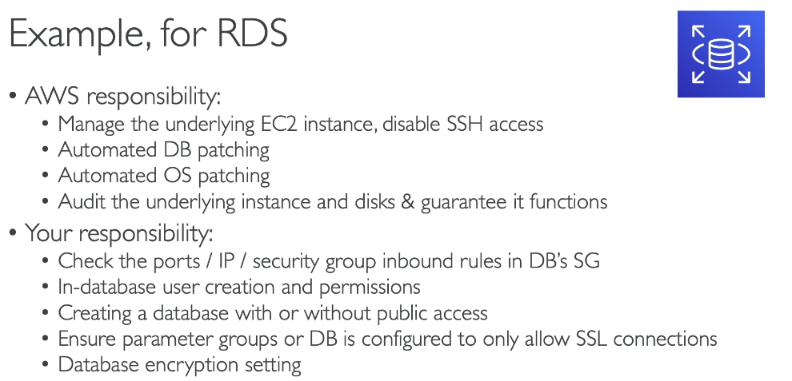
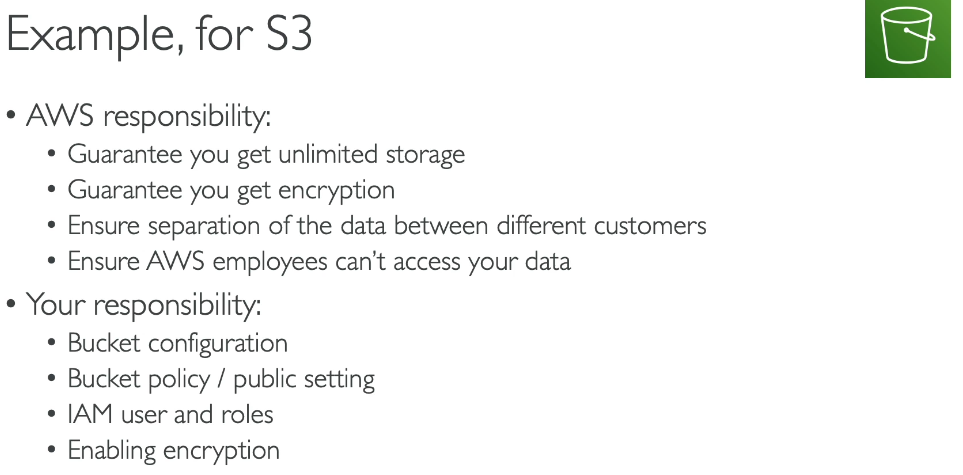
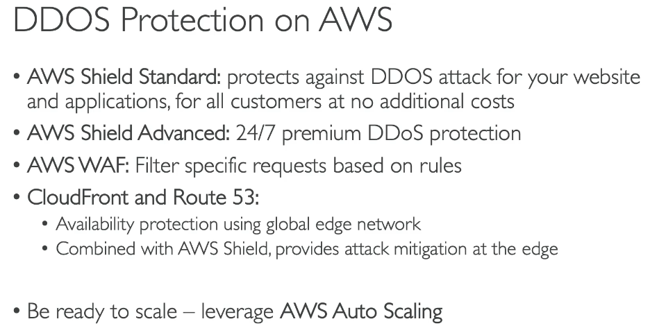
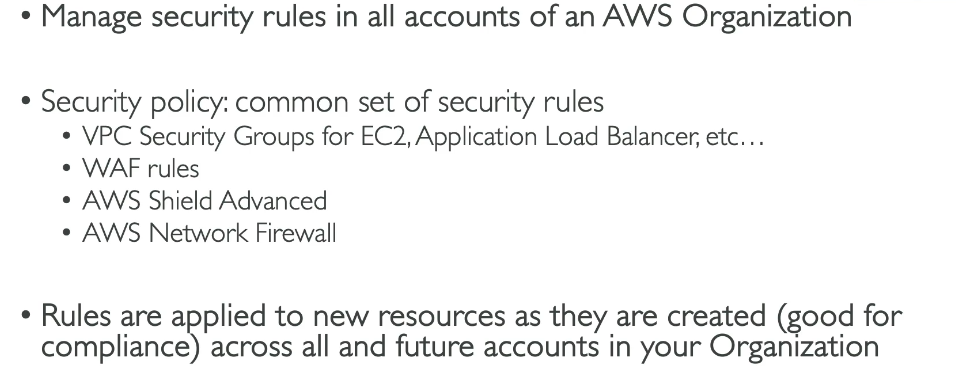
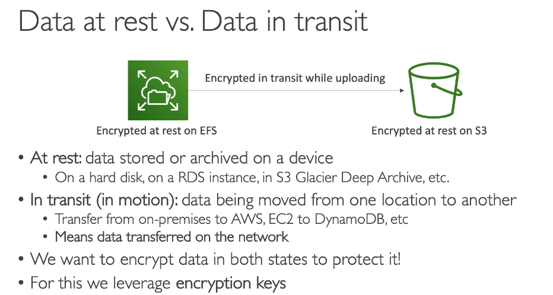
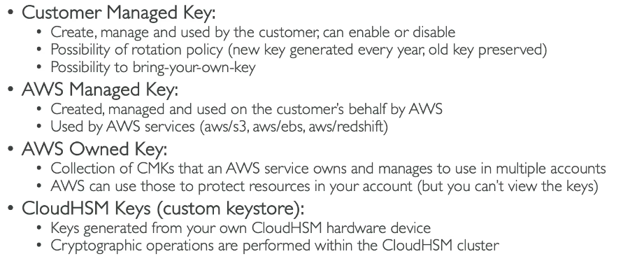
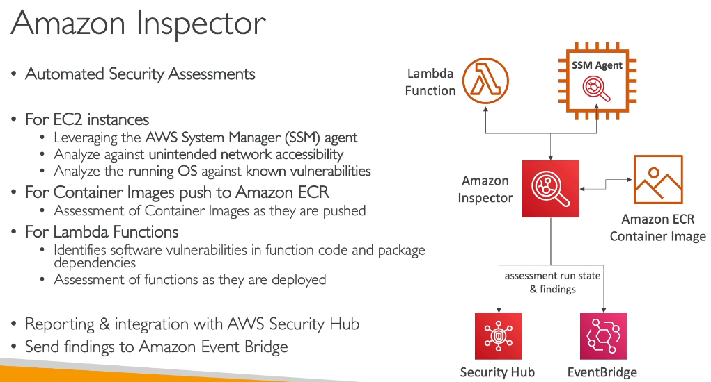
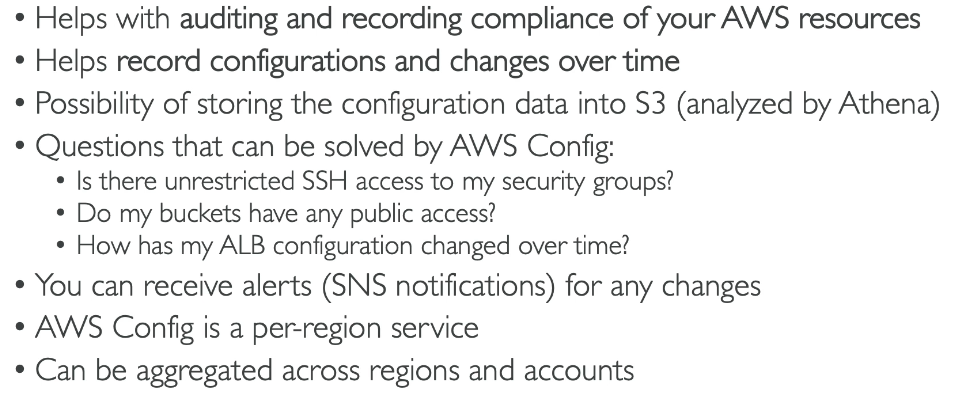
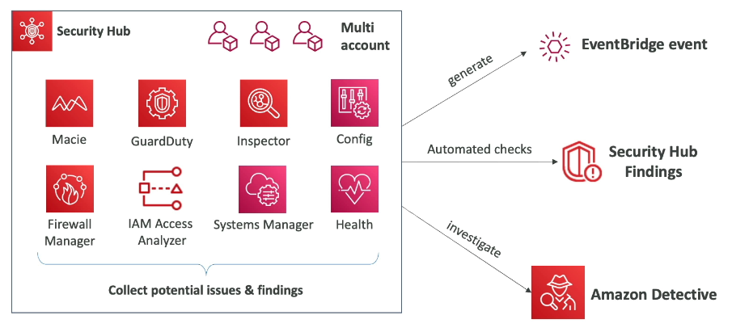

# Security and Compliance

> CLF-C02 focus: applying shared responsibility, protecting networks and data, managing encryption and secrets, finding threats and vulnerabilities, evaluating compliance, and securing the AWS account.

## Shared responsibility in practice

The core model is defined in [Cloud Computing](01-cloud-computing.md): AWS is responsible for security **of** the cloud, while customers are responsible for security **in** the cloud.

The boundary changes with the service:

- With EC2, AWS manages facilities, physical hardware, and the virtualization layer. The customer manages the guest operating system, patches, applications, data, identities, and network rules.
- With managed services such as RDS, AWS also manages more of the operating system and database infrastructure. The customer still manages data, database users, network access, and configurable security settings.
- With S3, AWS manages the storage infrastructure and durability mechanisms. The customer manages data classification, identities, bucket policies, public-access settings, and lifecycle choices.

The exam often asks who performs a task. The more managed the service is, the more infrastructure AWS operates, but customers always retain responsibility for their data and appropriate access.

## Defense in depth

AWS security controls protect different layers. These services complement rather than replace security groups, network ACLs, IAM, logging, and encryption.

### AWS WAF

AWS WAF is a web application firewall for HTTP and HTTPS requests at Layer 7. A web access control list contains rules that can allow, block, count, challenge, or apply CAPTCHA to matching requests.

High-yield rule conditions include IP addresses, geographic origin, request rates, headers, SQL injection patterns, and cross-site scripting patterns. WAF integrates with services including CloudFront, Application Load Balancer, and API Gateway REST APIs.

### AWS Shield

AWS Shield protects against distributed denial-of-service attacks.

| Tier | Exam-level distinction |
| --- | --- |
| Shield Standard | Automatically included DDoS protection for AWS customers at no additional Shield charge |
| Shield Advanced | Paid enhanced protection, better visibility, additional mitigations, and access to the Shield Response Team |

CloudFront and Route 53 can absorb attacks at the AWS edge. Auto Scaling can help an application handle legitimate demand, but it is not a substitute for DDoS protection.

### AWS Network Firewall

AWS Network Firewall is a managed network firewall and intrusion detection and prevention service for VPC traffic. It supports stateless and stateful inspection rules and can inspect traffic between subnets, VPCs, the internet, VPNs, and Direct Connect when routing is configured through its endpoints.

### AWS Firewall Manager

AWS Firewall Manager centrally applies and manages protection policies across accounts and resources in AWS Organizations. Supported policies include AWS WAF, Shield Advanced, VPC security groups, network ACLs, Network Firewall, and Route 53 Resolver DNS Firewall.

| Need | Service |
| --- | --- |
| Filter malicious HTTP/S requests | AWS WAF |
| Protect against DDoS attacks | AWS Shield |
| Inspect broader VPC network traffic | AWS Network Firewall |
| Centrally enforce firewall policies across accounts | AWS Firewall Manager |

## Encryption and data protection

Protect data in both states:

- **At rest:** Data stored on media, such as an S3 object, EBS volume, RDS database, or backup.
- **In transit:** Data moving across a network. TLS or an encrypted VPN commonly protects it.

> [!IMPORTANT]
> The source's blanket statement that EBS and RDS are not encrypted by default is not safe to memorize. Encryption defaults can depend on the service, account setting, and creation path. S3 automatically encrypts new uploads with SSE-S3, EBS supports an account-level encryption-by-default setting, and databases should be created with the required encryption configuration. On the exam, identify the correct encryption service and verify the resource setting rather than assuming.

## AWS Key Management Service

AWS Key Management Service (AWS KMS) is a managed service for creating and controlling cryptographic keys. Many AWS services integrate with KMS, and KMS API activity can be audited with CloudTrail.

KMS commonly uses envelope encryption: a data key encrypts the data, and a KMS key protects the data key. Applications do not normally send large datasets directly to KMS for encryption.

| Key type | Ownership and control |
| --- | --- |
| AWS owned key | Owned and fully managed by an AWS service; not visible in the customer account |
| AWS managed key | Exists in the customer account for a service; AWS manages its lifecycle and policy |
| Customer managed key | Created in the customer account; the customer controls policy, lifecycle, rotation options, and deletion |

Use a customer managed key when key-policy control, cross-account design, auditing, rotation choices, or lifecycle control is required.

## AWS CloudHSM

AWS CloudHSM provides dedicated hardware security modules in a customer-controlled cluster. AWS operates the physical HSM infrastructure, while the customer controls HSM users and cryptographic keys.

Use KMS for broad AWS-service integration and managed key operations. Use CloudHSM when dedicated HSMs and direct control of cryptographic operations are required by an application or compliance standard.

## AWS Certificate Manager

AWS Certificate Manager (ACM) provisions and manages TLS certificates for supported integrations such as Elastic Load Balancing, CloudFront, and API Gateway.

After domain ownership is validated, ACM can automatically renew eligible managed public certificates. A certificate proves an endpoint's identity and enables encrypted TLS connections; it does not replace authorization or application security.

## AWS Secrets Manager

AWS Secrets Manager stores and retrieves database credentials, API keys, OAuth tokens, and other application secrets. Secrets are encrypted using KMS and can be rotated automatically for supported services or through a rotation function.

Do not confuse these services:

| Need | Service |
| --- | --- |
| Manage encryption keys | AWS KMS |
| Use dedicated customer-controlled HSMs | AWS CloudHSM |
| Manage TLS certificates | AWS Certificate Manager |
| Store and rotate credentials or API secrets | AWS Secrets Manager |
| Store general configuration values and encrypted parameters | Systems Manager Parameter Store |

## AWS Artifact

AWS Artifact provides on-demand access to AWS security and compliance reports and selected agreements. Examples include SOC reports, ISO certifications, and PCI documentation.

Artifact helps supply evidence to auditors. It does not scan workloads, certify a customer's architecture automatically, or make the customer compliant by itself.

## Detection, assessment, and investigation services

These services are frequent comparison questions on CLF-C02.

| Service | Primary job |
| --- | --- |
| Amazon GuardDuty | Detect suspicious activity and threats from AWS data sources and protection plans |
| Amazon Inspector | Continuously scan eligible EC2 instances, ECR container images, and Lambda functions for vulnerabilities and unintended network exposure |
| AWS Config | Record resource configurations and evaluate them against compliance rules |
| Amazon Macie | Discover and classify sensitive data in Amazon S3 |
| AWS Security Hub | Centralize, correlate, prioritize, and assess security findings and posture |
| Amazon Detective | Investigate findings and suspicious activity using relationships, timelines, and visualizations |

### Amazon GuardDuty

GuardDuty is a threat detection service. Its foundational analysis uses sources including CloudTrail management events, VPC Flow Logs, and DNS logs. Optional protection plans extend coverage to resources such as S3, EKS, EC2, EBS, RDS, Lambda, and runtime activity.

GuardDuty creates findings; it does not replace a firewall or automatically patch vulnerabilities. Findings can be routed through EventBridge for notification or automated response.

### Amazon Inspector

Inspector is a vulnerability management service. It discovers and continually scans eligible EC2 instances, ECR images, and Lambda functions, then produces findings for software vulnerabilities or unintended network exposure.

Remember: **GuardDuty detects suspicious behavior; Inspector finds software vulnerabilities and exposure.**

### AWS Config

AWS Config records supported resource configurations and relationships over time. Config rules evaluate whether resources comply with desired settings.

Example questions Config can answer include:

- Did this security group ever allow unrestricted SSH?
- Which resources are noncompliant with a required rule?
- How did this bucket's configuration change over time?

Config shows configuration history and compliance. CloudTrail records API activity and helps identify who made a change.

### Amazon Macie

Macie uses managed data identifiers and pattern matching to discover sensitive data in S3, such as credentials, financial information, personally identifiable information, and protected health information.

### AWS Security Hub and Amazon Detective

Security Hub provides a central security view and receives findings from services such as GuardDuty, Inspector, Macie, and IAM Access Analyzer. It also supports security posture checks against standards and controls.

Detective helps analysts investigate a suspected security issue and determine its scope and root cause using automatically collected context and linked activity.

The simple exam sequence is:

1. GuardDuty, Inspector, Macie, Config, and other controls produce findings or compliance results.
2. Security Hub centralizes and prioritizes the security view.
3. Detective provides deeper investigation context.
4. EventBridge can route findings to notification or remediation targets.

## IAM Access Analyzer

IAM Access Analyzer evaluates policies and access paths to help identify unintended access.

- **External access findings:** Resources accessible from outside the selected account or organization, called the zone of trust.
- **Internal access findings:** Which principals inside the zone of trust can access selected resources.
- **Unused access findings:** Unused roles, credentials, or permissions that can be reduced.

For CLF-C02, prioritize the classic scenario: finding an S3 bucket, KMS key, IAM role, SQS queue, or other supported resource that a resource policy shares outside the zone of trust.

IAM policy structure and evaluation remain in [IAM Identity and Access](02-iam-identity-and-access.md).

## Root user and privileged tasks

The root user has unrestricted account access and should not be used for everyday work. Protect it with MFA and do not create root access keys unless an exceptional task requires them.

Examples of tasks that can require root credentials for a standalone account include:

- Changing root credentials or the root email address
- Closing the account
- Restoring IAM administrator permissions after lockout
- Activating IAM access to the Billing console
- Enabling S3 MFA Delete
- Correcting an S3 bucket policy or SQS resource policy that denies every principal
- Signing up for AWS GovCloud (US)

The exact list can change. AWS Organizations can centrally perform some privileged tasks for member accounts when centralized root access is enabled, so use the current AWS root-user documentation rather than memorizing every historical example.

## Reporting abuse of AWS resources

Report suspected AWS resources being used for spam, malware, denial-of-service attacks, intrusion attempts, or other abusive activity to AWS Trust and Safety. This reporting path concerns abuse originating from AWS resources; use normal security incident and Support processes for incidents in your own account.

## Service selection practice

| Scenario | Correct service |
| --- | --- |
| Block SQL injection attempts at an ALB | AWS WAF |
| Add managed DDoS protection | AWS Shield |
| Inspect stateful VPC network traffic | AWS Network Firewall |
| Apply WAF policies across organization accounts | AWS Firewall Manager |
| Control and audit encryption keys | AWS KMS |
| Store and rotate a database password | AWS Secrets Manager |
| Download an AWS SOC report | AWS Artifact |
| Detect suspicious API or network activity | Amazon GuardDuty |
| Find vulnerable software packages on EC2 | Amazon Inspector |
| Find PII in S3 objects | Amazon Macie |
| Evaluate whether resources follow configuration rules | AWS Config |
| Aggregate and prioritize security findings | AWS Security Hub |
| Investigate the root cause of a finding | Amazon Detective |
| Find resources shared outside the organization | IAM Access Analyzer |

## Exam memory checks

1. **Who protects AWS facilities and physical hardware?** AWS.
2. **Who protects customer data and configures access?** The customer.
3. **Which service filters HTTP/S web requests?** AWS WAF.
4. **Which service protects against DDoS attacks?** AWS Shield.
5. **Which service centrally manages firewall policies across accounts?** AWS Firewall Manager.
6. **Which service manages encryption keys for many AWS services?** AWS KMS.
7. **Which service provides dedicated customer-controlled HSMs?** AWS CloudHSM.
8. **Which service manages TLS certificates?** AWS Certificate Manager.
9. **Which service stores and rotates application secrets?** AWS Secrets Manager.
10. **Which service supplies AWS compliance reports?** AWS Artifact.
11. **Which service detects suspicious behavior?** GuardDuty.
12. **Which service scans workloads for vulnerabilities?** Inspector.
13. **Which service records configuration history and evaluates rules?** AWS Config.
14. **Which service discovers sensitive data in S3?** Macie.
15. **Which service centralizes security findings?** Security Hub.
16. **Which service supports deeper security investigation?** Detective.
17. **Which service identifies external resource sharing?** IAM Access Analyzer.

## Avoiding duplication in other chapters

- Shared-responsibility fundamentals: [Cloud Computing](01-cloud-computing.md)
- Users, groups, roles, policies, MFA, and credential reports: [IAM Identity and Access](02-iam-identity-and-access.md)
- Security groups, network ACLs, endpoints, VPN, and Direct Connect: [VPC and Networking](13-vpc-and-networking.md)
- S3 encryption and bucket access controls: [Amazon S3 and Hybrid Storage](07-amazon-s3-and-hybrid-storage.md)
- CloudWatch, CloudTrail, EventBridge, X-Ray, and AWS Health: [Cloud Monitoring and Auditing](12-cloud-monitoring-and-auditing.md)
- Organizations, service control policies, Control Tower, and billing access: Account Management and Billing
- IAM Identity Center, STS, Cognito, and Directory Service: Advanced Identity
- Backup policies, recovery objectives, and disaster-recovery strategies: later chapters

## References

- [AWS shared responsibility model](https://docs.aws.amazon.com/whitepapers/latest/introduction-devops-aws/shared-responsibility.html)
- [AWS WAF, Shield, and Firewall Manager](https://docs.aws.amazon.com/waf/latest/developerguide/what-is-aws-waf.html)
- [AWS Network Firewall documentation](https://docs.aws.amazon.com/network-firewall/)
- [AWS KMS key types](https://docs.aws.amazon.com/kms/latest/developerguide/concepts.html)
- [AWS CloudHSM documentation](https://docs.aws.amazon.com/cloudhsm/)
- [AWS Certificate Manager public certificates](https://docs.aws.amazon.com/acm/latest/userguide/acm-public-certificates.html)
- [What is AWS Secrets Manager?](https://docs.aws.amazon.com/secretsmanager/latest/userguide/intro.html)
- [AWS Artifact documentation](https://docs.aws.amazon.com/artifact/)
- [What is Amazon GuardDuty?](https://docs.aws.amazon.com/guardduty/latest/ug/)
- [What is Amazon Inspector?](https://docs.aws.amazon.com/inspector/latest/user/what-is-inspector.html)
- [How AWS Config works](https://docs.aws.amazon.com/config/latest/developerguide/how-does-config-work.html)
- [Amazon Macie documentation](https://docs.aws.amazon.com/macie/)
- [Introduction to AWS Security Hub](https://docs.aws.amazon.com/securityhub/latest/userguide/what-is-securityhub-v2.html)
- [IAM Access Analyzer findings](https://docs.aws.amazon.com/IAM/latest/UserGuide/access-analyzer-findings.html)
- [Tasks requiring root user credentials](https://docs.aws.amazon.com/IAM/latest/UserGuide/id_root-user.html#root-user-tasks)
