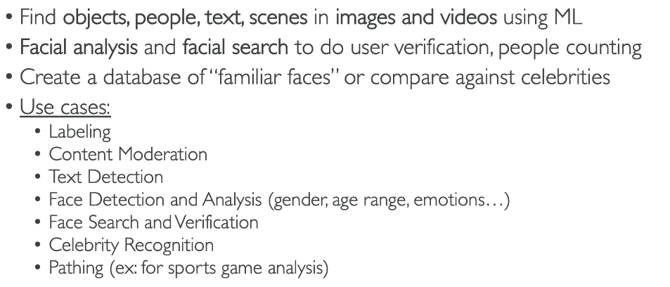
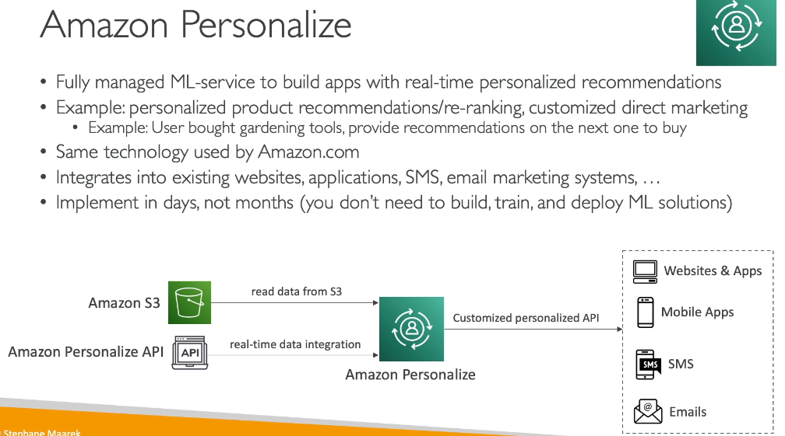

# Machine Learning and AI

> CLF-C02 focus: recognize the AWS AI service that matches a business task. You do not need to train a model or know ML algorithms.

## Choosing an AI service

| Task | Service | Remember |
| --- | --- | --- |
| Detect objects, scenes, text, or unsafe content in images and video | Amazon Rekognition | Visual analysis |
| Convert speech to written text | Amazon Transcribe | Speech to text |
| Convert written text to lifelike speech | Amazon Polly | Text to speech |
| Translate between languages | Amazon Translate | Language translation |
| Build conversational voice or text interfaces | Amazon Lex | Chatbots and virtual agents |
| Find language, entities, sentiment, and key phrases in text | Amazon Comprehend | Natural-language analysis |
| Extract printed text, handwriting, tables, and form fields from documents | Amazon Textract | Document extraction |
| Build, train, and deploy custom ML models | Amazon SageMaker AI | ML development platform |
| Use an AWS generative AI assistant for work or development | Amazon Q | AI assistant |

These are recognition-level distinctions. For example, a photograph of a receipt can involve **Rekognition** if the task is to classify what is pictured, or **Textract** if the task is to extract the receipt's line items and fields.

## Amazon Rekognition

Rekognition analyzes images and videos. It can identify objects, scenes, activities, faces, and text, and can help detect inappropriate content. Its role is visual analysis; it does not transcribe speech or extract structured fields from a document.

The image is from the source notes. Remember the service's purpose rather than memorizing every listed facial-analysis feature.

## Language, speech, and document services

- **Transcribe** turns audio into text, such as call transcripts; supported features include identifying speakers and redacting selected sensitive information.
- **Polly** synthesizes speech from text, such as spoken announcements or an application's voice response.
- **Translate** translates text between languages for multilingual content.
- **Comprehend** analyzes text for meaning, sentiment, entities, key phrases, and topics. It is not a translation service.
- **Textract** reads documents and extracts text and structure, including tables and forms. The source's brief description of it as extracting data from images is true but incomplete.

## Conversational AI and ML development

**Amazon Lex** builds conversational interfaces that understand spoken or typed requests. It can be used for chatbots and contact-center self-service. **Amazon Connect** supplies the cloud contact center itself: it handles customer interactions and contact flows. A Connect contact flow can use Lex for a conversational bot. Connect is categorized as a business application in the exam guide.

**Amazon SageMaker AI** is for creating and running custom machine learning solutions, including model preparation, training, and deployment. Choose it when a team needs to build its own ML model rather than use a ready-made service such as Transcribe or Textract.

**Amazon Q** is an AWS generative AI assistant. Amazon Q Business can answer questions grounded in connected company information; Amazon Q Developer can assist with AWS and software-development tasks. At exam level, distinguish an assistant from a custom-model development platform like SageMaker AI.

## Lower-priority services in the source notes

The PDF also covers **Amazon Kendra**, an enterprise search service that answers natural-language questions over indexed information. It is not named on the current CLF-C02 in-scope list, so it is lower priority than the services in the table above.

**Amazon Personalize** makes personalized recommendations. It appears in the PDF, but the current CLF-C02 guide explicitly lists it as out of scope. Keep the diagram as part of the source notes; do not make it a study priority.

## Exam memory checks

1. **Speech to text or text to speech?** Transcribe is speech to text; Polly is text to speech.
2. **Image classification or form extraction?** Rekognition analyzes images and video; Textract extracts text and structure from documents.
3. **Language analysis or translation?** Comprehend analyzes text; Translate changes its language.
4. **Chatbot or contact center?** Lex builds conversational interfaces; Connect provides contact-center capabilities.
5. **Custom model or AI assistant?** SageMaker AI develops ML models; Amazon Q provides an AI assistant.

## References

- [CLF-C02 in-scope services](https://docs.aws.amazon.com/aws-certification/latest/cloud-practitioner-02/clf-02-in-scope-services.html)
- [CLF-C02 out-of-scope services](https://docs.aws.amazon.com/aws-certification/latest/cloud-practitioner-02/clf-02-out-of-scope-services.html)
- [Amazon Rekognition documentation](https://docs.aws.amazon.com/rekognition/)
- [Amazon Textract documentation](https://docs.aws.amazon.com/textract/)
- [Amazon SageMaker AI documentation](https://docs.aws.amazon.com/sagemaker/)
- [Amazon Q Business](https://docs.aws.amazon.com/amazonq/latest/qbusiness-ug/what-is.html)
- [Amazon Q Developer](https://docs.aws.amazon.com/amazonq/latest/qdeveloper-ug/what-is.html)
