# Account Management, Billing, and Support

> CLF-C02 focus: multi-account governance, purchasing choices, cost tools, and the appropriate AWS Support option. Learn why to choose a tool or pricing model; exact prices change.

## AWS Organizations and organizational units

**AWS Organizations** centrally manages multiple AWS accounts. Separate accounts can isolate production from development, separate teams or regulatory environments, and simplify cost ownership. An organization has one **management account** and can group member accounts into **organizational units (OUs)**. An account can belong to one OU at a time; OUs can be nested.

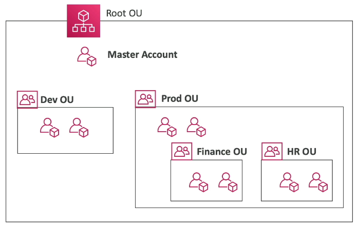

The source image says "Master Account"; AWS now calls this the **management account**. Accounts within an OU can inherit governance policies. For ordinary resource permissions inside an account, use IAM as described in [IAM Identity and Access](02-iam-identity-and-access.md).

### Service control policies

A **service control policy (SCP)** sets a permissions boundary for accounts in an organization. It can restrict which AWS service actions principals in a member account may use, including that account's root user. It **never grants** a permission by itself: an IAM or resource policy must also allow the action.

- SCPs attach to an organization root, OU, or account and combine through the hierarchy.
- The default `FullAWSAccess` SCP permits all actions at the organization boundary. Additional explicit denies can narrow it. An allow-list design instead requires explicit allows through the hierarchy.
- SCPs do not restrict principals in the Organizations management account or service-linked roles.

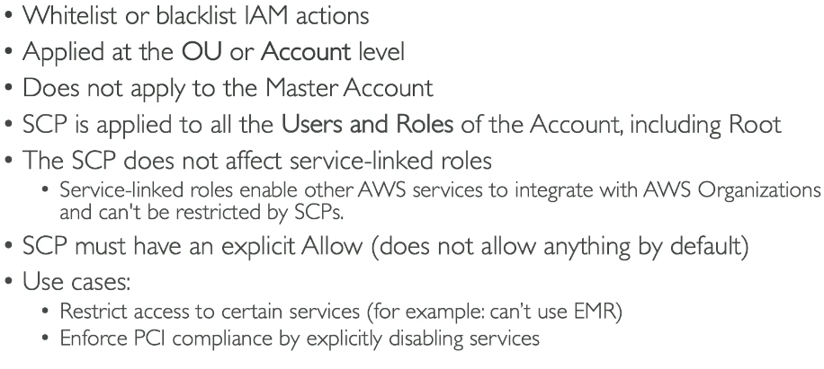

The screenshot uses older wording and implies every SCP needs an explicit allow. Read that as applying to an **allow-list approach**; the default `FullAWSAccess` is already an allow-all SCP. It also says "does not apply to the Master Account," meaning the current **management account**.

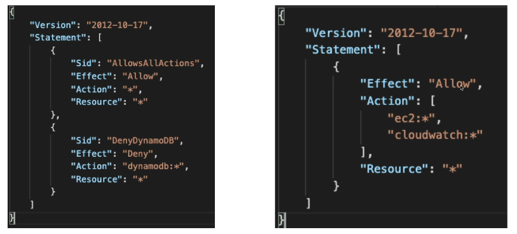

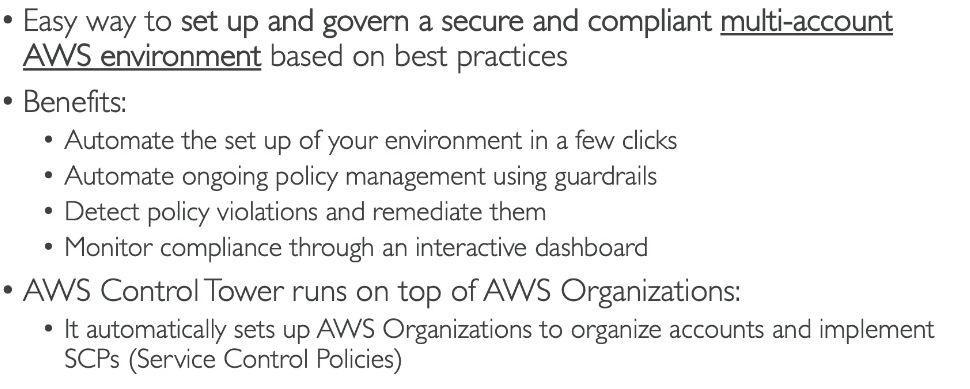

For an exam scenario, remember **IAM grants permissions; SCPs cap the maximum permissions a member account can use**. The exact JSON syntax is secondary.

### Consolidated billing

Consolidated billing gives the organization one bill while retaining cost detail for each account. Eligible usage may combine for volume discounts, and eligible Reserved Instance or Savings Plans benefits may be shared across accounts, subject to sharing preferences and the pricing rules. It does not merge the accounts or their resources.

### AWS Control Tower

Control Tower helps set up and govern a multi-account AWS environment, often called a landing zone. It uses AWS Organizations and other services to create accounts, establish baseline controls, monitor compliance, and provide a governance dashboard. An OU is the account grouping; an SCP is one possible guardrail; Control Tower coordinates the broader setup.

## Sharing and governance tools

| Tool | Main purpose |
| --- | --- |
| AWS Resource Access Manager (AWS RAM) | Share supported resources, such as subnets or transit gateways, with other accounts without duplicating them |
| AWS Service Catalog | Offer approved, centrally managed products for users to deploy through self-service |
| AWS License Manager | Track and govern software licenses, including bring-your-own-license arrangements |
| Service Quotas | View service quotas and request increases for adjustable quotas |
| AWS Compute Optimizer | Recommend better-sized supported compute and storage resources based on utilization |

**Example:** Service Quotas helps when an application needs a higher Lambda concurrency quota. Compute Optimizer helps when a running EC2 instance appears oversized. Licenses are a separate cost consideration: **BYOL** uses an eligible license you already own, while **license included** incorporates the software license in the AWS service price.

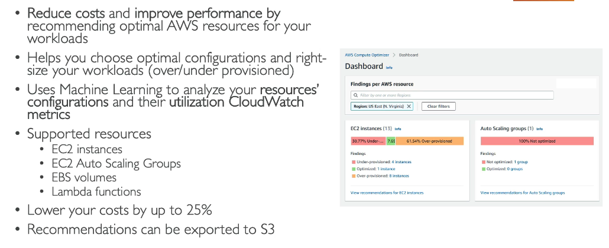

## Pricing principles

AWS commonly charges for **compute used**, **data stored**, **requests made**, and **data transferred**. The source summarizes the value proposition as pay as you go, save when you commit, and benefit from greater usage or AWS scale. Compare the total cost, including on-premises hardware, facilities, power, operations, and licensing, with cloud costs. Rightsizing, turning off unused resources, automation, and selecting suitable storage classes help control spending.

AWS Free Tier offers eligible free usage or credits subject to the current account plan and offer terms. Do not assume every service is free or that old Free Tier limits still apply.

### EC2 purchasing options

| Option | Best fit | Commitment or capacity distinction |
| --- | --- | --- |
| On-Demand Instances | Short or unpredictable usage | No long-term commitment; pay for the instance while it runs |
| Reserved Instances (RIs) | Steady eligible EC2 usage | One- or three-year pricing commitment; Standard and Convertible choices |
| Savings Plans | Steady compute spending across eligible services | Commit to a spend amount per hour for one or three years |
| Spot Instances | Flexible, interruption-tolerant work | Uses spare EC2 capacity at a discount; AWS can interrupt the instance |
| Dedicated Instances | Hardware isolation from other customers | Runs on single-tenant hardware; less host-level visibility |
| Dedicated Hosts | Need a whole physical server, such as for licensing | Host-level control and visibility for eligible licenses |
| On-Demand Capacity Reservations | Need assured EC2 capacity in a selected AZ | Reserves capacity without itself providing a discount |

**Savings Plans versus RIs:** Compute Savings Plans are broadly flexible across eligible EC2, Fargate, and Lambda usage; EC2 Instance Savings Plans focus on an instance family in a Region. AWS also offers Database and SageMaker AI Savings Plans for eligible workloads. RIs apply to eligible EC2 instance usage and differ in exchange flexibility. Some regional RI configurations have size flexibility, while a zonal RI also reserves capacity. Pricing benefits can be shared through Organizations when sharing is enabled.

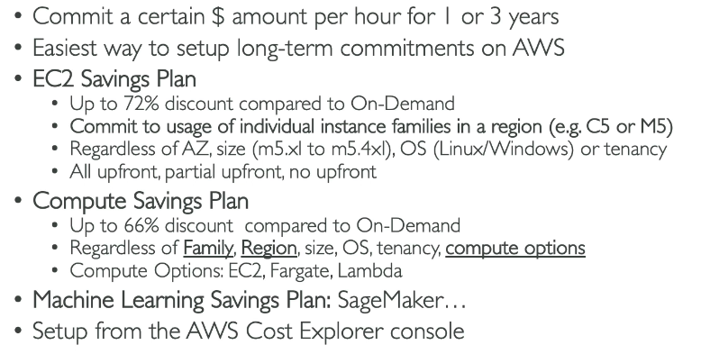

The diagram contains historical discount percentages and product names. Study the **spend commitment and flexibility**, not the pictured percentages.

### Other compute and data charges

- **Lambda:** Requests and execution duration, with additional charges for some optional features.
- **Fargate:** Requested vCPU, memory, and related resources while a task runs.
- **S3:** Storage class and amount, requests, retrieval and lifecycle operations where applicable, and data transfer.
- **EBS:** Provisioned storage and performance, snapshots, and applicable transfer charges.
- **RDS:** DB capacity and deployment choice, storage, provisioned I/O or requests where applicable, backups beyond included allowances, and data transfer.
- **CloudFront:** Data delivered to viewers and requests, with prices affected by geography and options.

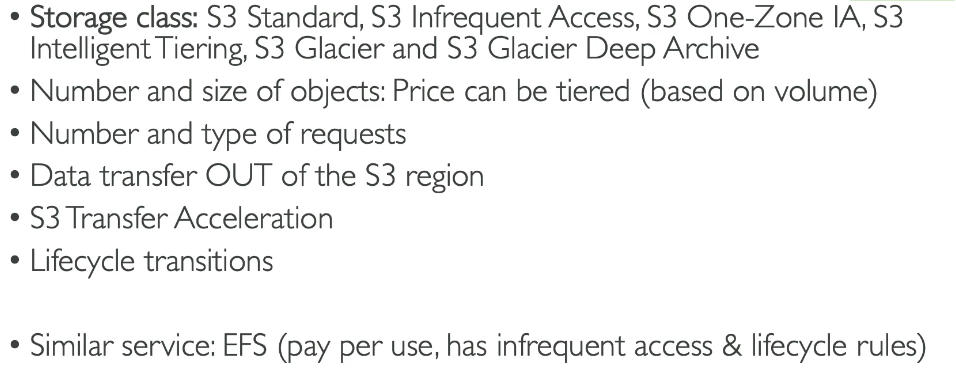

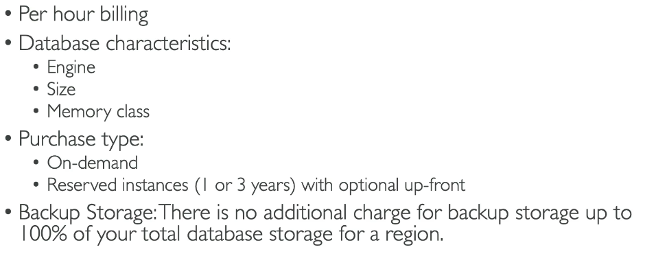

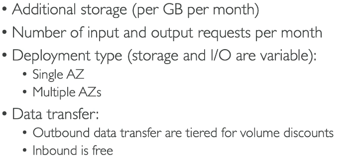

The images illustrate **what may be billed**, not current prices or universal free-backup allowances. Use service pricing pages or AWS Pricing Calculator for actual estimates.

### Data transfer

Data transfer **into AWS from the internet is generally free**, while transfer **out to the internet**, between Regions, or across certain AZ and service boundaries can incur charges. The path, service, Region, and use of public versus private networking affect the bill. Do not treat all traffic within an AWS Region as free.

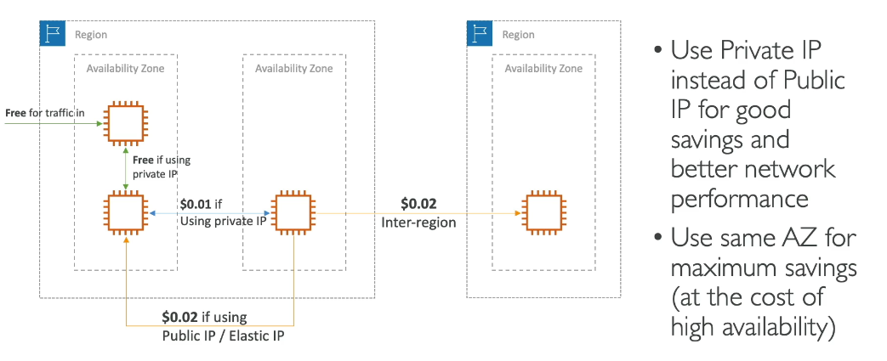

The pictured dollar amounts are examples from the PDF and should not be memorized. For a design choice, compare the current AWS data transfer pricing for the exact route.

## Estimating, analyzing, and controlling costs

| Tool | Use it when you need to... |
| --- | --- |
| AWS Pricing Calculator | Estimate a proposed workload before deployment |
| Billing and Cost Management console | View current bills, payment information, and account charges |
| AWS Cost Explorer | Visualize historical spend, filter or group it, and forecast costs |
| AWS Cost and Usage Reports (CUR) | Export detailed line-item usage and cost data for analysis |
| AWS Budgets | Set cost, usage, RI, or Savings Plans budgets and receive alerts |
| AWS Cost Anomaly Detection | Identify unusual spend patterns and alert on potential cost spikes |

**Cost allocation tags** are key-value labels activated for billing reports. AWS-generated tags use an `aws:` prefix; user-defined tags use a `user:` prefix in reports. A consistent tag such as `CostCenter=Research` helps allocate shared costs to teams or projects.

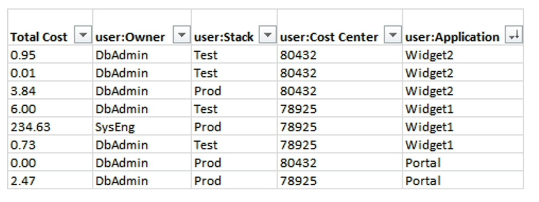

CUR supplies granular data that can be analyzed in S3 and with analytics tools. Cost Explorer offers quick graphs and forecasts. Budgets and billing alarms alert against configured thresholds; anomaly detection looks for unusual changes rather than a fixed spending cap.

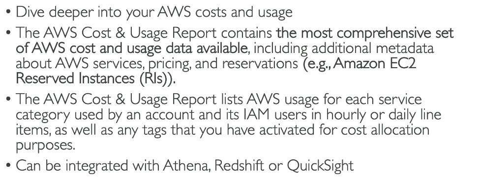

## AWS Trusted Advisor and Support

**AWS Trusted Advisor** checks an account against AWS best practices, including cost optimization, security, fault tolerance, performance, service limits, and operational excellence. Basic Support includes core checks; broader checks and organizational guidance depend on the Support plan. **AWS Health Dashboard** gives a personalized view of AWS events affecting services or your resources, and the **AWS Health API** enables programmatic access for supported plans. CloudWatch and CloudTrail have their own monitoring and audit roles in [Cloud Monitoring and Auditing](12-cloud-monitoring-and-auditing.md).

As of October 2026, the current AWS plan comparison emphasizes:

| Plan | Typical need |
| --- | --- |
| Basic | Included customer service, account/billing help, documentation, AWS re:Post, core Trusted Advisor checks, and AWS Health |
| Business Support+ | Production workloads needing around-the-clock technical support and a full set of Trusted Advisor checks |
| Enterprise Support | Business-critical workloads needing designated technical account guidance and proactive reviews |
| Unified Operations | Mission-critical workloads needing enhanced monitoring, incident response, and application-specific expertise |

The PDF mentions older **Developer**, **Business (classic)**, and **Enterprise On-Ramp** plans. The official CLF-C02 guide still names these as examples, but AWS stopped taking new Developer and Business (classic) subscriptions in December 2025 and says existing subscribers can continue until January 2027. Learn the role of each support level and check current AWS plan pages before memorizing plan names, prices, or response-time promises.

For older exam wording, **Developer** meant technical support for development and testing during business hours; **Business (classic)** meant 24/7 technical support for production workloads; **Enterprise On-Ramp** added more proactive, enterprise-style help. AWS is retiring all three in January 2027 outside GovCloud. The current plans above are the better default for real-world choices.

Use the **AWS Support Center** to open and manage cases according to the plan. Documentation, whitepapers, AWS Prescriptive Guidance, AWS re:Post, and the AWS Knowledge Center provide self-service answers; [AWS Architecting and Ecosystem](19-aws-architecting-and-ecosystem.md) covers the broader partner and Marketplace resources.

## Exam memory checks

1. **What groups member accounts for governance?** Organizations OUs.
2. **Can an SCP grant access?** No. It limits the maximum permissions available in member accounts.
3. **What provides one bill for multiple accounts?** Organizations consolidated billing.
4. **What sets up a governed multi-account landing zone?** AWS Control Tower.
5. **What is best for interruptible jobs?** EC2 Spot Instances.
6. **What reserves AZ capacity without a pricing discount by itself?** On-Demand Capacity Reservations.
7. **Estimate future spend or inspect actual spend?** Pricing Calculator estimates; Cost Explorer analyzes actual and forecast costs.
8. **Detailed cost data or threshold alert?** CUR exports detailed data; Budgets alerts against plans.
9. **Which service recommends rightsizing?** AWS Compute Optimizer.
10. **Which tool assesses account best practices?** AWS Trusted Advisor.

## References

- [CLF-C02 billing, pricing, and support domain](https://docs.aws.amazon.com/aws-certification/latest/cloud-practitioner-02/cloud-practitioner-02-domain4.html)
- [AWS Organizations User Guide](https://docs.aws.amazon.com/organizations/latest/userguide/orgs_introduction.html)
- [Service control policies](https://docs.aws.amazon.com/organizations/latest/userguide/orgs_manage_policies_scps.html)
- [AWS Control Tower User Guide](https://docs.aws.amazon.com/controltower/latest/userguide/what-is-control-tower.html)
- [AWS Savings Plans](https://docs.aws.amazon.com/savingsplans/latest/userguide/what-is-savings-plans.html)
- [Savings Plans types](https://docs.aws.amazon.com/savingsplans/latest/userguide/plan-types.html)
- [AWS Cost Explorer](https://docs.aws.amazon.com/cost-management/latest/userguide/ce-what-is.html)
- [AWS Cost and Usage Reports](https://docs.aws.amazon.com/cur/latest/userguide/what-is-cur.html)
- [AWS Support plan comparison](https://aws.amazon.com/premiumsupport/plans/)
- [AWS Support plan FAQ](https://aws.amazon.com/premiumsupport/faqs/)
- [Legacy Support plan transition](https://docs.aws.amazon.com/awssupport/latest/user/support-plans-eos.html)
