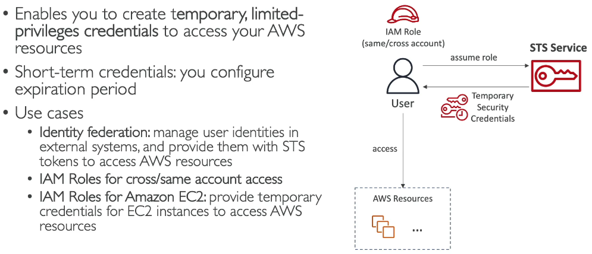

# Advanced Identity

> CLF-C02 focus: recognize temporary credentials, workforce single sign-on, application-user authentication, and directory integration. IAM users, groups, roles, and policy evaluation are covered in [IAM Identity and Access](02-iam-identity-and-access.md).

## AWS Security Token Service

**AWS Security Token Service (STS)** issues temporary, limited-duration credentials. A set of temporary credentials includes an access key ID, secret access key, and session token. The credentials expire; they are useful for assuming IAM roles rather than distributing permanent access keys.

Common STS scenarios include:

- An EC2 or Lambda workload receiving temporary role credentials.
- A user in one AWS account assuming a role in another account.
- A federated user receiving access to AWS resources through an identity provider.

**Federation** lets people use an existing identity system to access AWS. The IAM role trust policy defines who can assume the role, and the role permissions define what the temporary session can do. See the IAM chapter for the underlying role model.

## AWS IAM Identity Center

IAM Identity Center, formerly AWS Single Sign-On, provides a central sign-in experience for a workforce across multiple AWS accounts and supported applications. It can use its own identity directory or connect to an existing identity provider. Administrators assign users or groups to accounts with **permission sets**, which provision the needed account roles.

Use it when employees should sign in once and access several accounts or business applications without managing separate long-term IAM users in each account. AWS Organizations supplies the account structure; IAM Identity Center supplies the workforce access experience.

## Amazon Cognito

Cognito provides sign-up, sign-in, and identity features for users of a web or mobile application.

| Component | Main purpose |
| --- | --- |
| User pool | User directory and authentication for application users |
| Identity pool | Provides temporary AWS credentials for authorized application users, often after federation |

Choose Cognito for **customer or application-user authentication**. Choose IAM Identity Center for **employees and workforce access** to AWS accounts and business applications.

## AWS Directory Service

AWS Directory Service offers directory choices for Microsoft Active Directory workloads and integration.

- **AWS Managed Microsoft AD:** A managed Active Directory in AWS for directory-aware workloads.
- **AD Connector:** A proxy that lets AWS services use an existing on-premises Active Directory without storing a separate directory of those users in AWS.

Use Directory Service when the requirement specifically involves AD authentication, domain membership, or compatible enterprise directory features; Cognito and IAM Identity Center solve different sign-in scenarios.

## Exam memory checks

1. **What issues temporary AWS credentials?** STS.
2. **What should employees use for single sign-on across AWS accounts?** IAM Identity Center.
3. **What authenticates users of a mobile application?** Cognito user pools.
4. **What can grant an app user temporary AWS credentials?** A Cognito identity pool.
5. **What connects AWS applications to an existing on-premises Active Directory?** Directory Service AD Connector.

## References

- [AWS STS temporary security credentials](https://docs.aws.amazon.com/IAM/latest/UserGuide/id_credentials_temp.html)
- [AWS IAM Identity Center](https://docs.aws.amazon.com/singlesignon/latest/userguide/what-is.html)
- [What is Amazon Cognito?](https://docs.aws.amazon.com/cognito/latest/developerguide/what-is-amazon-cognito.html)
- [AWS Directory Service](https://docs.aws.amazon.com/directoryservice/latest/admin-guide/what_is.html)
