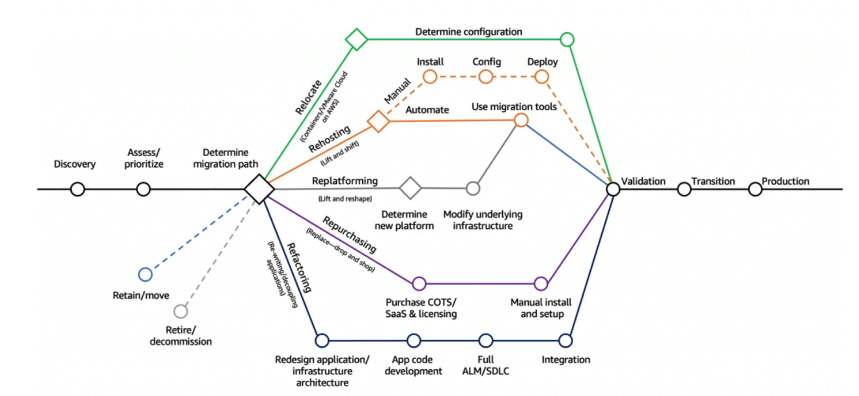
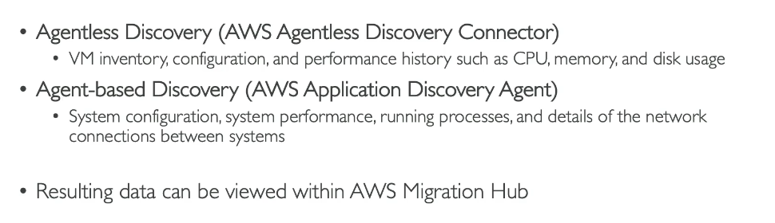

# Other Services, Backup, and Migration

> CLF-C02 focus: match less common service categories to their use cases, understand recovery objectives and migration choices, and recognize repeatable infrastructure deployment. Core compute, databases, storage, networking, and security are covered in earlier chapters.

## End-user computing, mobile, and business services

| Requirement | AWS service | Main distinction |
| --- | --- | --- |
| Give a user a managed virtual desktop | Amazon WorkSpaces | Desktop as a service |
| Stream individual desktop applications | Amazon AppStream 2.0 / Amazon WorkSpaces Applications | Application streaming, without delivering a full desktop |
| Isolate a user's web browsing in AWS | Amazon WorkSpaces Secure Browser | Hosted browser for web and SaaS access |
| Build and deploy web or mobile frontends | AWS Amplify | Frontend development and hosting tools |
| Connect, secure, and manage IoT devices | AWS IoT Core | Device messaging and connection to AWS |
| Send application or transactional email | Amazon SES | Email sending and receiving service |

The PDF calls AppStream 2.0 an application streaming service. AWS documentation now uses the name **Amazon WorkSpaces Applications** for it, while the CLF-C02 service list still says AppStream 2.0. WorkSpaces provides a desktop; AppStream/WorkSpaces Applications streams applications; Secure Browser streams an isolated browser session. The latter is still named in the exam guide, though AWS has announced it will close to new customers on October 29, 2026.

**Amazon Connect**, introduced with Lex in [Machine Learning and AI](15-machine-learning.md), is the in-scope cloud contact center. **Amazon SES** is for email delivery; it is not a contact center or a chatbot.

## Infrastructure as code and workflows

**AWS CloudFormation** provisions AWS resources from a template. A template describes the desired infrastructure, and a **stack** is a collection of resources created and managed from it. Use infrastructure as code when deployments must be repeatable and version controlled; a one-time console action can be appropriate for an isolated manual change. The AWS Management Console, CLI, SDKs, and service APIs are other ways to operate AWS. The AWS CLI and SDKs are defined in [IAM Identity and Access](02-iam-identity-and-access.md).

**AWS Step Functions** coordinates a workflow of multiple steps, such as Lambda functions and other AWS services. It tracks state and can handle decisions, retries, and errors. Choose Step Functions to orchestrate a process; choose EventBridge to route events, SQS to buffer work, and SNS to fan out notifications. See [Cloud Integrations](11-cloud-integrations.md) for those messaging services.

## AWS Backup

**AWS Backup** centrally creates and manages backups for supported AWS services. A backup plan defines schedules, retention, and backup rules; resources can be assigned to that plan. AWS Backup supports on-demand backups and features such as cross-Region or cross-account copies for supported resource types.

Backup is different from service-specific resilience features: an S3 version, EBS snapshot, or RDS Multi-AZ standby can help with a particular failure or recovery need, but a backup policy addresses retention and recovery across resources. Use AWS Backup when the question asks for **centralized backup management**.

## Disaster recovery

| Term | Meaning |
| --- | --- |
| Recovery Point Objective (RPO) | Maximum acceptable amount of data loss, expressed as time since the last recoverable copy |
| Recovery Time Objective (RTO) | Maximum acceptable time to restore service after an outage |

A lower RPO generally requires more frequent replication or backup; a lower RTO generally requires more ready-to-run capacity. These objectives guide the recovery strategy.

| Strategy | What is ready before failure | Typical tradeoff |
| --- | --- | --- |
| Backup and restore | Backups, with little or no live secondary environment | Lowest standby cost; longer recovery |
| Pilot light | Essential core systems or data kept ready | Faster recovery than backup alone; remaining services must start |
| Warm standby | A smaller working copy of the application | Faster recovery; ongoing secondary cost |
| Active-active / multi-site | Full workloads serving traffic in multiple locations | Fast recovery potential; highest operating complexity and cost |

**AWS Elastic Disaster Recovery (DRS)** continuously replicates source servers at the block level and helps recover on-premises or cloud-based servers into AWS after an outage. It is a disaster-recovery tool. **AWS Application Migration Service (MGN)** also uses replication, but its main job is to **migrate** servers into AWS.

## Moving data and workloads to AWS

The source notes introduce **AWS DataSync** for moving data between on-premises storage and AWS or between supported storage services. It can schedule or incrementally transfer data. It is useful context, but is not named on the current CLF-C02 in-scope service list. Database migration is already covered in [Databases and Analytics](08-databases-and-analytics.md): DMS moves database data, and AWS SCT helps convert schemas when engines differ.

### Seven common migration strategies

| Strategy | Short meaning |
| --- | --- |
| Retire | Turn off an application that is no longer needed |
| Retain | Keep it where it is for now |
| Relocate | Move the infrastructure or platform location with limited application change |
| Rehost | Lift and shift a workload with minimal change |
| Replatform | Make limited changes to gain a managed-service benefit |
| Repurchase | Replace the application with a different product, often SaaS |
| Refactor / re-architect | Redesign the application to use a different architecture |

Example: moving a server into EC2 largely unchanged is **rehosting**; moving a self-managed database to RDS while keeping the application mostly intact is **replatforming**.

### Discovery, assessment, and execution

| Tool | Main job |
| --- | --- |
| AWS Application Discovery Service | Collect information about on-premises servers and their dependencies for migration planning |
| Migration Evaluator | Build a data-based business case and cost comparison for migration |
| AWS Migration Hub | View migration information and progress in a central place |
| AWS Application Migration Service (MGN) | Rehost physical, virtual, or cloud servers on AWS |

The screenshot names an older **Discovery Connector**. AWS ended support for that connector in November 2025; recognize the service purpose, not that retired collection method. AWS also stopped opening Application Discovery Service and Migration Hub to new customers in November 2025, though both remain on the current exam service list. Existing users can continue using them.

## Source-note extras to recognize only

- **AWS AppSync:** Managed GraphQL APIs for web and mobile applications; it is mentioned in the PDF but is not named in the current in-scope list.
- **AWS Infrastructure Composer / former Application Composer:** Visual tool for designing serverless applications and CloudFormation templates. Application Composer appears on the exam guide's explicit out-of-scope list.
- **AWS Device Farm:** Test applications on real mobile devices; explicitly out of scope.
- **AWS Fault Injection Service:** Controlled fault experiments; not named in the current in-scope list.
- **AWS Ground Station:** Satellite communications; explicitly out of scope.
- **Amazon Pinpoint:** Multi-channel customer messaging in the PDF. AWS has announced end of support on October 30, 2026; it is not named in the current in-scope list. For exam email scenarios, know Amazon SES.

## Exam memory checks

1. **Virtual desktop, streamed app, or isolated browser?** WorkSpaces, AppStream 2.0 / WorkSpaces Applications, or WorkSpaces Secure Browser.
2. **Repeatable resource deployment?** CloudFormation templates and stacks.
3. **Orchestrate a multi-step workflow?** Step Functions.
4. **Centrally schedule backups?** AWS Backup.
5. **Maximum data loss versus recovery duration?** RPO versus RTO.
6. **Recover replicated servers after failure versus migrate them?** Elastic Disaster Recovery versus Application Migration Service.
7. **Build a migration business case?** Migration Evaluator.
8. **Send application email?** Amazon SES.

## References

- [CLF-C02 technology and services domain](https://docs.aws.amazon.com/aws-certification/latest/cloud-practitioner-02/cloud-practitioner-02-domain3.html)
- [CLF-C02 in-scope services](https://docs.aws.amazon.com/aws-certification/latest/cloud-practitioner-02/clf-02-in-scope-services.html)
- [CLF-C02 out-of-scope services](https://docs.aws.amazon.com/aws-certification/latest/cloud-practitioner-02/clf-02-out-of-scope-services.html)
- [Amazon WorkSpaces Applications](https://docs.aws.amazon.com/appstream2/latest/developerguide/what-is-appstream.html)
- [Amazon WorkSpaces Secure Browser availability](https://docs.aws.amazon.com/workspaces-web/latest/adminguide/workspaces-secure-browser-maintenance-mode.html)
- [AWS CloudFormation User Guide](https://docs.aws.amazon.com/AWSCloudFormation/latest/UserGuide/Welcome.html)
- [AWS Backup documentation](https://docs.aws.amazon.com/aws-backup/)
- [AWS Elastic Disaster Recovery documentation](https://docs.aws.amazon.com/drs/)
- [AWS Application Migration Service documentation](https://docs.aws.amazon.com/mgn/)
- [AWS service availability updates](https://aws.amazon.com/about-aws/whats-new/2025/10/aws-service-availability/)
- [Amazon Pinpoint end of support](https://docs.aws.amazon.com/pinpoint/latest/userguide/what-is-pinpoint.html)
