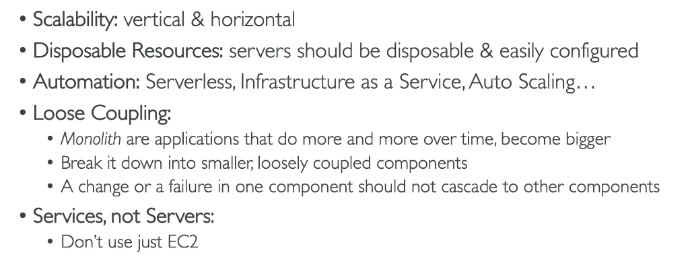
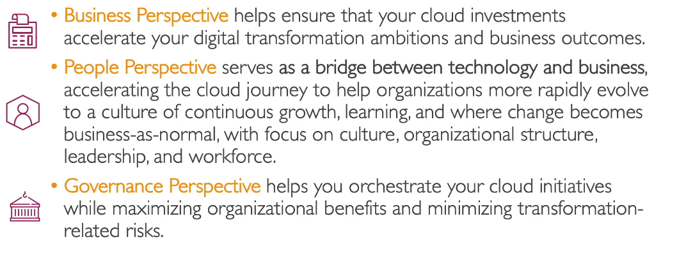
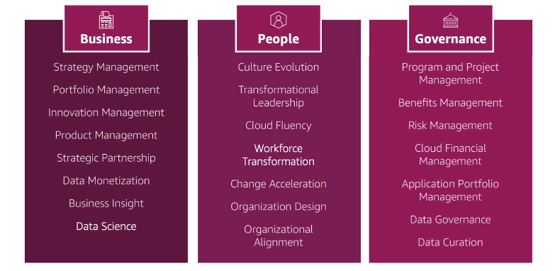
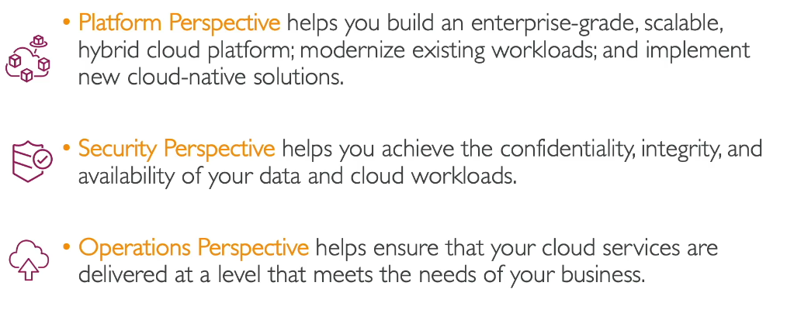
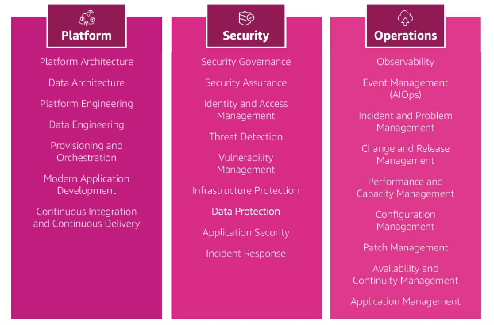
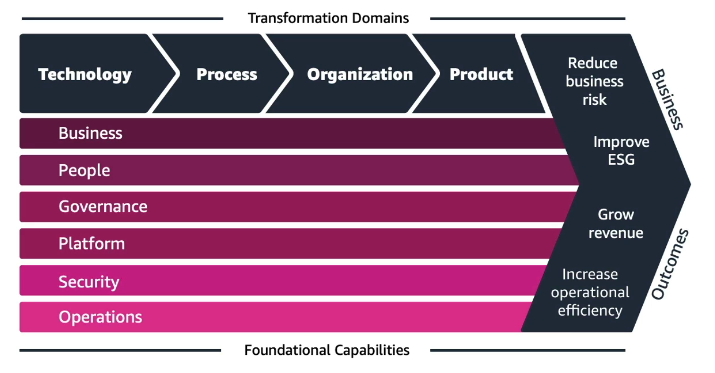
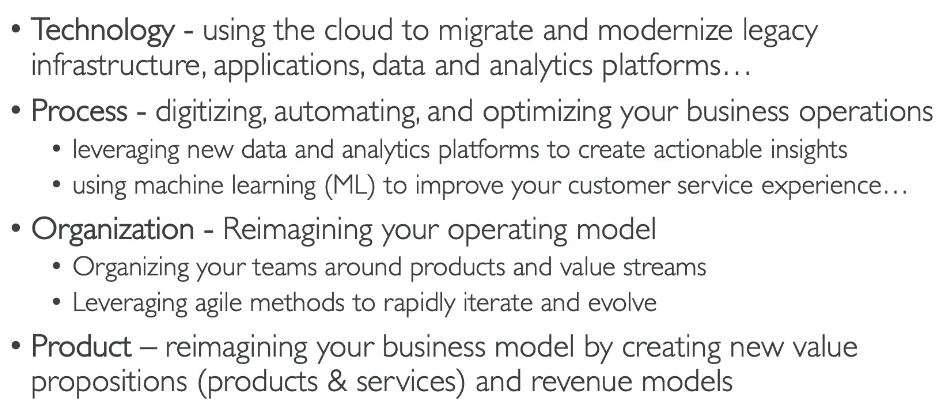

# AWS Architecting and Ecosystem

> CLF-C02 focus: identify the six AWS Well-Architected pillars, the six AWS Cloud Adoption Framework (AWS CAF) perspectives, and the AWS resources that help customers learn, buy, and get assistance. The exam asks you to recognize principles and choose appropriate resources; it does not require you to design an architecture.

## Start with the two frameworks

| Framework | Main question | Unit of focus | Six names to know |
| --- | --- | --- | --- |
| **AWS Well-Architected Framework** | Is this **workload** designed and operated well? | A workload, such as one application | Operational Excellence, Security, Reliability, Performance Efficiency, Cost Optimization, Sustainability |
| **AWS Cloud Adoption Framework (AWS CAF)** | Is this **organization** ready to adopt and transform with cloud? | Business, people, processes, and technology across an organization | Business, People, Governance, Platform, Security, Operations |

**Security** and **Operations** appear in both. For Well-Architected, ask about the qualities of a workload. For CAF, ask which organizational capability or group needs to change. An exam question about training employees belongs to **CAF People**; a question about a workload recovering after an AZ failure belongs to **Well-Architected Reliability**.

## AWS Well-Architected Framework: six pillars

The framework gives a consistent way to review a workload against cloud best practices and identify improvements. Use these six short questions as a memory aid:

| Pillar | Ask yourself | Typical exam clues |
| --- | --- | --- |
| **Operational Excellence** | Can we run, monitor, learn, and improve the workload? | Runbooks, observability, small reversible changes, learning from incidents |
| **Security** | Are systems and data protected? | Identity, least privilege, detection, encryption, incident response |
| **Reliability** | Will it work when needed and recover from failure? | Availability, fault tolerance, failover, backups, disaster recovery |
| **Performance Efficiency** | Are resources chosen and adjusted to meet performance needs? | Latency, throughput, correct resource type, scaling with demand |
| **Cost Optimization** | Are we delivering business value for the lowest appropriate cost? | Rightsizing, unused resources, spending visibility, purchasing choices |
| **Sustainability** | How can we reduce environmental impact? | Energy efficiency, utilization, resource use, carbon footprint |

### Operational Excellence

This pillar is about **operating and improving** the workload. Define procedures, observe what is happening, automate safe changes, make frequent small changes that can be reversed, and learn from failures. A game day is a planned exercise to see how people and systems respond to a problem. The PDF's phrase *prepare, operate, evolve* is a useful prompt.

**Example:** A team uses monitoring, a runbook, and post-incident reviews so it can detect failures and improve its response. The focus is the team's operational practice, even if some individual changes also improve reliability.

### Security

Protect data, systems, and assets. Use strong identities and least privilege, enable traceability, apply controls in layers, protect data at rest and in transit, and prepare for security events. The [Security and Compliance](14-security-and-compliance.md) chapter owns the service details; here the exam task is recognizing **protection** as the pillar.

**Example:** Encrypting sensitive data and restricting who may access it is primarily a Security concern.

### Reliability

Make a workload perform correctly and consistently when expected, and recover when something fails. Test recovery, automate recovery where appropriate, and avoid a single point of failure. Multi-AZ deployment, health checks, backups, and failover are common examples; [Other Services, Backup, and Migration](18-other-services-backup-and-migration.md) explains RTO and RPO.

**Example:** Adding a standby in another AZ so service continues after an AZ failure is primarily Reliability. Operational Excellence would focus more on how the team detects, responds to, and learns from the event.

### Performance Efficiency

Choose and adjust resources to meet performance requirements as demand and technology change. Compare suitable compute, storage, and database options; use elastic scaling, managed services, or global delivery where they improve the required latency or throughput.

**Example:** Switching to a better-suited EC2 instance family to meet a response-time target is primarily Performance Efficiency. The same change may also affect cost, but the **reason stated in the question** determines the best pillar.

### Cost Optimization

Deliver business value at the lowest appropriate cost. Make spending visible, avoid idle or oversized resources, match purchasing options to usage, and use consumption-based services where they make sense. [Account Management, Billing, and Support](16-account-management-billing-and-support.md) covers the actual tools and pricing models.

**Example:** Reducing monthly spend by removing idle instances or choosing a suitable Savings Plan is primarily Cost Optimization. **Rightsizing** means using enough resources to meet the workload's needs without paying for unnecessary capacity; it does not mean always selecting the cheapest resource.

### Sustainability

Reduce the environmental impact of running a workload, especially energy and resource use. Measure impact, set sustainability goals, increase utilization, and avoid unnecessary processing or storage. Autoscaling, efficient hardware, managed services, and lifecycle policies can contribute. Their presence alone does not prove sustainability; look for an **environmental objective** in the question.

**Example:** Reducing idle capacity to lower energy use is primarily Sustainability, even if it also lowers cost.

### Source-note architecture habits

The PDF also lists useful general habits: stop guessing capacity, test at production scale, automate experiments, let architectures evolve, use data to guide changes, and practice failure response. It recommends loose coupling, disposable and repeatable resources, horizontal scaling when appropriate, and choosing managed services based on the need rather than defaulting to a virtual server.

These are recognition-level principles for CLF-C02. You do not need to draw a detailed cloud architecture to answer framework questions.

## AWS Well-Architected Tool

The **AWS Well-Architected Tool** is the AWS service for reviewing a workload against the Well-Architected Framework. You answer questions about the workload, record decisions, identify high- and medium-risk issues, and use an improvement plan to prioritize changes. The review process is available at no additional Tool charge. It does not automatically fix resources or certify that a workload is compliant.

| Need | Best starting answer |
| --- | --- |
| Review one workload across the six pillars | AWS Well-Architected Tool |
| Assess an account against broad best-practice checks | AWS Trusted Advisor, covered in [Account Management, Billing, and Support](16-account-management-billing-and-support.md) |
| Recommend a better size for eligible resources | AWS Compute Optimizer, covered in the billing chapter |
| Plan organizational cloud adoption and capability gaps | AWS CAF |

## AWS Cloud Adoption Framework: six perspectives

AWS CAF helps an organization plan cloud adoption and digital transformation. A **perspective** groups related organizational capabilities and stakeholders. The first three below are a useful **business and organizational** group; the last three are a **technical delivery** group. Know each perspective's purpose, not every capability listed in the source diagrams.

| Perspective | Main responsibility | Example exam scenario |
| --- | --- | --- |
| **Business** | Link cloud investment to strategy, customer value, and business outcomes | Leadership asks which cloud initiatives will grow revenue or improve products |
| **People** | Build skills, culture, leadership, and organizational readiness for change | Employees need training or teams must change how they work |
| **Governance** | Coordinate initiatives, manage risk, measure benefits, and control finances and policy | A steering group needs oversight, risk controls, and cost accountability |
| **Platform** | Build and modernize the cloud foundation, applications, and data platforms | Engineers need a scalable landing zone or reusable application platform |
| **Security** | Protect data and workloads and meet security and compliance needs | Security leaders define identity, data protection, and threat controls |
| **Operations** | Run cloud services to meet business needs | Operations teams need monitoring, incident management, and service continuity |

A compact memory cue is **why, who, govern, build, protect, run**: Business, People, Governance, Platform, Security, Operations.

### Business, People, and Governance

**Business** asks whether cloud initiatives support measurable business value. **People** asks whether staff, leadership, culture, and team structure can support the change. **Governance** asks how programs are coordinated and how benefits, risk, policy, and spending are controlled.

**Distinguish them:** a new product and revenue target is Business; retraining engineers is People; deciding who approves projects and monitors risk is Governance. A question can mention several groups: choose the perspective that owns the **main problem**.

### Platform, Security, and Operations

**Platform** is the technical foundation and how workloads are built or modernized. **Security** sets and applies protection and assurance capabilities. **Operations** keeps cloud services running, monitored, supported, and improved at the level the business needs.

**Distinguish them:** establishing a reusable cloud platform is Platform; defining identity and encryption controls is Security; creating an incident process and service monitoring is Operations.

### Transformation domains, outcomes, and phases

The six **perspectives** are capabilities that support four **transformation domains**. These are different lists:

| Transformation domain | What changes |
| --- | --- |
| Technology | Migrate or modernize infrastructure, applications, and data |
| Process | Digitize, automate, and improve business operations |
| Organization | Rework teams and the operating model to deliver value faster |
| Product | Create or improve products, services, and revenue models |

AWS CAF describes outcomes such as **reduced business risk**, **better environmental, social, and governance (ESG) performance**, **increased revenue**, and **increased operational efficiency**. These are benefits of successful transformation, not four extra perspectives.

AWS CAF also describes a repeating journey: **Envision** the desired outcomes, **Align** stakeholders and identify capability gaps, **Launch** pilots, then **Scale** what works. For CLF-C02, prioritize the six perspectives, the distinction from Well-Architected pillars, and the business outcomes. The phases are helpful context rather than a list of services to memorize.

## AWS learning, security, and support resources

Choose a resource based on what the person needs:

| Need | Resource |
| --- | --- |
| Official service instructions, APIs, and configuration details | AWS Documentation |
| Strategy, frameworks, and technical background | AWS whitepapers |
| AWS announcements and technical articles | AWS Blogs, including the AWS Security Blog |
| Step-by-step patterns for migration and operations | AWS Prescriptive Guidance |
| Community questions and answers | AWS re:Post |
| Official answers to frequent customer questions | AWS Knowledge Center articles on re:Post |
| Curated ready-to-use solution patterns | AWS Solutions Library |
| Security practices, compliance programs, and protection guidance | AWS security pages and the AWS Trust Center; the exam guide also refers to the AWS Security Center |
| AWS audit and compliance reports | AWS Artifact, explained in [Security and Compliance](14-security-and-compliance.md) |
| Open a technical or billing case under an AWS Support plan | AWS Support Center, explained in the billing chapter |

The AWS Security Blog and security pages are **information sources**. For security capabilities, think of services such as GuardDuty, Inspector, WAF, and Security Hub. AWS Marketplace can also supply third-party security software. AWS Trusted Advisor can flag certain account security issues; those service distinctions are covered in the earlier chapters.

## AWS Marketplace, partners, and expert help

**AWS Marketplace** is a catalog for finding, purchasing, and deploying third-party software and services. Offerings can include SaaS, AMIs, container products, and professional services. Eligible purchases appear through AWS billing and can be analyzed in cost reports. Organizations can use **Private Marketplace** to curate approved products and govern new subscriptions; AWS Marketplace also manages subscriptions and entitlements. This is the exam-level answer when the scenario asks how to acquire third-party software on AWS.

The **AWS Partner Network (APN)** is the community of organizations that build, sell, and deliver AWS-based solutions. **Independent software vendors (ISVs)** build software; **services partners or system integrators** help customers plan, migrate, integrate, or operate solutions. Partner programs can provide training, certification, events, marketing support, and program-specific commercial benefits such as eligible volume discounts. AWS Marketplace is a purchasing channel; APN is the partner ecosystem.

**AWS Solutions Architects** provide architecture guidance and can review workloads. **AWS Professional Services** helps customers carry out cloud transformation and implementation projects. Partners can also provide implementation help. AWS Support is the route for support cases; the plan distinctions are in [Account Management, Billing, and Support](16-account-management-billing-and-support.md).

The PDF mentions **AWS Managed Services**, which can operate customer infrastructure. It is explicitly on the current CLF-C02 out-of-scope service list, so treat it as background rather than a memorization target.

## Source-note update: carbon footprint tool

The PDF names the **Customer Carbon Footprint Tool** for tracking AWS-related emissions. AWS deprecated that tool in June 2026 in favor of **AWS Sustainability**, which provides environmental impact information. Neither tool is a named in-scope CLF-C02 service. For the exam, focus on the **Sustainability pillar** and the reason for measuring and reducing environmental impact.

## Exam practice: choose the correct framework or perspective

1. **An application must continue serving users if an AZ fails. Which pillar?** Reliability.
2. **A team adds runbooks, incident reviews, and small reversible changes. Which pillar?** Operational Excellence.
3. **A service must maintain latency as traffic rises. Which pillar?** Performance Efficiency.
4. **A company wants to lower its monthly cloud bill without missing workload requirements. Which pillar?** Cost Optimization.
5. **A company wants to reduce the energy impact of unused capacity. Which pillar?** Sustainability.
6. **The question asks about least privilege and encryption. Which pillar?** Security.
7. **An organization needs to retrain teams before migration. Which CAF perspective?** People.
8. **Executives ask how cloud investment supports a new product and revenue target. Which CAF perspective?** Business.
9. **Leaders need risk oversight, policy, and financial accountability. Which CAF perspective?** Governance.
10. **Engineers need a reusable cloud foundation. Which CAF perspective?** Platform.
11. **The security office defines data protection and threat detection. Which CAF perspective?** Security.
12. **The operations team must monitor services and manage incidents. Which CAF perspective?** Operations.
13. **What reviews a workload across all six pillars?** AWS Well-Architected Tool.
14. **Where can a company buy third-party security software on AWS?** AWS Marketplace.
15. **Where can you find official answers to frequent AWS customer questions?** AWS Knowledge Center on re:Post.

## References

- [CLF-C02 Cloud Concepts scope](https://docs.aws.amazon.com/aws-certification/latest/cloud-practitioner-02/cloud-practitioner-02-domain1.html)
- [CLF-C02 Security and Compliance scope](https://docs.aws.amazon.com/aws-certification/latest/cloud-practitioner-02/cloud-practitioner-02-domain2.html)
- [CLF-C02 Billing, Pricing, and Support scope](https://docs.aws.amazon.com/aws-certification/latest/cloud-practitioner-02/cloud-practitioner-02-domain4.html)
- [Six pillars of the AWS Well-Architected Framework](https://docs.aws.amazon.com/wellarchitected/latest/framework/the-pillars-of-the-framework.html)
- [AWS Well-Architected Tool](https://docs.aws.amazon.com/wellarchitected/latest/userguide/intro.html)
- [AWS CAF perspectives](https://docs.aws.amazon.com/whitepapers/latest/overview-aws-cloud-adoption-framework/foundational-capabilities.html)
- [AWS CAF transformation domains and outcomes](https://docs.aws.amazon.com/whitepapers/latest/overview-aws-cloud-adoption-framework/accelerating-business-outcomes.html)
- [AWS CAF cloud transformation journey](https://docs.aws.amazon.com/whitepapers/latest/overview-aws-cloud-adoption-framework/your-cloud-transformation-journey.html)
- [AWS Marketplace Private Marketplace](https://docs.aws.amazon.com/marketplace/latest/buyerguide/private-marketplace-current.html)
- [AWS Partner Paths](https://aws.amazon.com/partners/isv/)
- [AWS Knowledge Center](https://repost.aws/knowledge-center)
- [AWS Sustainability](https://docs.aws.amazon.com/sustainability/latest/userguide/what-is-sustainability.html)
- [AWS Billing history: Customer Carbon Footprint Tool deprecation](https://docs.aws.amazon.com/awsaccountbilling/latest/aboutv2/History.html)
